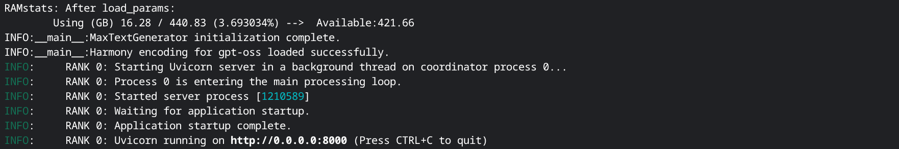
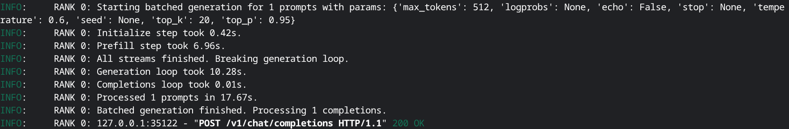
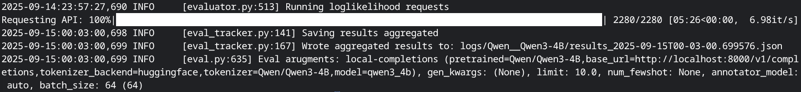

# MaxText API Server

This directory contains an OpenAI-compatible API server for serving MaxText models, enabling benchmarks with evaluation frameworks like lm-eval-harness and evalchemy. It uses [FastAPI](https://fastapi.tiangolo.com/) as the web framework and can be deployed on a single machine or a multi-host GKE cluster.

## Table of Contents
- [Installation](#installation)
- [Environment Variables](#environment-variables)
- [Launching the Server (Single-Host)](#launching-the-server-single-pod)
- [Deploying on a GKE Cluster (Multi-Host)](#deploying-on-a-gke-cluster-multi-host)
- [Interacting with the Server](#interacting-with-the-server)
- [Benchmarking with Evaluation Frameworks](#benchmarking-with-evaluation-frameworks)


## Installation

The server has a few additional dependencies beyond the core MaxText requirements. Install them using the provided `requirements.txt` file:

```bash
pip install -r benchmarks/api_server/requirements.txt
```

## Environment Variables

Before launching the server, you may need to set the following environment variable:

- `HF_TOKEN`: Your Hugging Face access token. This is required if the model's tokenizer is hosted on the Hugging Face Hub and is not public.

```bash
export HF_TOKEN=<your_hugging_face_token>
```

## Launching the Server (Single-Host)

The primary way to launch the API server is by using the `start_server.sh` script. This script ensures that the server is run from the project's root directory, which is necessary for the Python interpreter to find all the required modules.

The script takes the path to a base configuration file (e.g., `maxtext/configs/base.yml`) followed by any number of model-specific configuration overrides.

### Benchmarking Configuration

To use this server for benchmarking with frameworks like `lm-eval-harness` or `evalchemy`, you **must** include the following two arguments in your launch command:

- `tokenizer_type="huggingface"`: Ensures the tokenizer is compatible with the evaluation harness.
- `return_log_prob=True`: Enables the log probability calculations required for many standard evaluation metrics.

### Command Structure

```bash
bash benchmarks/api_server/start_server.sh /path/to/base.yml [arg1=value1] [arg2=value2] ...
```

### Example

Here is an example of how to launch the server with a `qwen3-30b-a3b` model, configured for benchmarking. This example is configured for a TPU v5p-8, which has 4 chips.

```bash
# Make sure you are in the root directory of the maxtext project.

bash benchmarks/api_server/start_server.sh \
    maxtext/configs/base.yml \
    model_name="qwen3-30b-a3b" \
    tokenizer_path="Qwen/Qwen3-30B-A3B-Thinking-2507" \
    load_parameters_path="<path_to_your_checkpoint>" \
    per_device_batch_size=4 \
    ici_tensor_parallelism=4 \
    max_prefill_predict_length=1024 \
    max_target_length=2048 \
    async_checkpointing=false \
    scan_layers=false \
    attention="dot_product" \
    tokenizer_type="huggingface" \
    return_log_prob=True
```

Once the server starts successfully, you will see a confirmation message from Uvicorn:



```
INFO:     RANK 0: Uvicorn running on http://0.0.0.0:8000 (Press CTRL+C to quit)
```

The server is now ready to accept requests on port 8000.

## Deploying on a GKE Cluster (Multi-Host)

For large models that require a multi-host TPU setup, you can deploy the server using the [xpk (Kubernetes Pod Executor) tool](https://github.com/AI-Hypercomputer/xpk). The recommended approach is to create a single submission script to configure and launch the workload.


### 1. Create a Job Submission Script

Create a new bash script (e.g., `launch_gke_server.sh`) to hold your configuration and `xpk` command. This makes launching jobs repeatable and easy to modify.

For your convenience, the script below is also available as a template file at `benchmarks/api_server/launch_gke_server.sh.template`.

Inside this script, you will define the server's startup command and your cluster configuration. Before running the script, define the placeholders at the top of the file. Placeholders are enclosed in angle brackets (e.g., `<your_gcp_project>`).

```bash
#!/bin/bash
set -e

# ==============================================================================
# 1. User-Configurable Variables
# ==============================================================================

# -- GKE Cluster Configuration --
# (<your_gke_cluster>, <your_gcp_project>, <your_gcp_zone>)
export CLUSTER="<your-gke-cluster>"
export DEVICE_TYPE="v5p-16"
export PROJECT="<your-gcp-project>"
export ZONE="<your-gcp-zone>"

# -- XPK Workload Configuration --
# (<YYYY-MM-DD>, <your_hugging_face_token>)
export RUNNAME="my-server-$(date +%Y-%m-%d-%H-%M-%S)"
export DOCKER_IMAGE="gcr.io/tpu-prod-env-multipod/maxtext_jax_nightly:<YYYY-MM-DD>"
export HF_TOKEN="<your_hugging_face_token>" # Optional: if your tokenizer is private

# -- Model Configuration --
# IMPORTANT: Replace these with your model's details.
# (<your_model_name>, <path_or_name_to_your_tokenizer>, <path_to_your_checkpoint>)
export MODEL_NAME="qwen3-30b-a3b"
export TOKENIZER_PATH="Qwen/Qwen3-30B-A3B-Thinking-2507"
export LOAD_PARAMETERS_PATH="<path_to_your_checkpoint>"
export PER_DEVICE_BATCH_SIZE=4
# Parallelism settings should match the number of chips on your device.
# For a v5p-16 (8 chips), the product of parallelism values should be 8.
export ICI_TENSOR_PARALLELISM=4
export ICI_EXPERT_PARALLELISM=2

# ==============================================================================
# 2. Define the Command to Run on the Cluster
# ==============================================================================
# This command installs dependencies and then starts the server.
CMD="export HF_TOKEN=${HF_TOKEN} && \
     pip install --upgrade pip && \
     pip install -r benchmarks/api_server/requirements.txt && \
     bash benchmarks/api_server/start_server.sh \
        maxtext/configs/base.yml \
        model_name="${MODEL_NAME}" \
        tokenizer_path="${TOKENIZER_PATH}" \
        load_parameters_path="${LOAD_PARAMETERS_PATH}" \
        per_device_batch_size=${PER_DEVICE_BATCH_SIZE} \
        ici_tensor_parallelism=${ICI_TENSOR_PARALLELISM} \
        ici_expert_parallelism=${ICI_EXPERT_PARALLELISM} \
        tokenizer_type=\"huggingface\" \
        return_log_prob=True"


# ==============================================================================
# 3. Launch the Workload
# ==============================================================================
echo "Launching workload ${RUNNAME}..."
xpk workload create --workload "${RUNNAME}" \
  --base-docker-image "${DOCKER_IMAGE}" \
  --command "${CMD}" \
  --num-slices=1  \
  --cluster "${CLUSTER}" --device-type "${DEVICE_TYPE}" --project "${PROJECT}" --zone "${ZONE}"

echo "Workload ${RUNNAME} created."
echo "Use the following command to connect:"
echo "bash benchmarks/api_server/port_forward_xpk.sh job_name=${RUNNAME} project=${PROJECT} zone=${ZONE} cluster=${CLUSTER}"
```

### 2. Launch the Workload

Make the script executable and run it:

```bash
chmod +x launch_gke_server.sh
./launch_gke_server.sh
```

### 3. Connect to the Server

The API server only runs on the first host/worker (rank 0 on GPU) of the workload. To connect to it, use the `port_forward_xpk.sh` script as instructed in the output of your launch script.

```bash
bash benchmarks/api_server/port_forward_xpk.sh \
  job_name=<your_job_name> \
  project=<your-gcp-project> \
  zone=<your-gcp-zone> \
  cluster=<your-gke-cluster>
```

The script will automatically find the correct pod and establish the port-forward connection. Your server is now accessible at `http://localhost:8000`.

## Interacting with the Server

Once the server is running (either locally or connected via port-forwarding), you can interact with it using any standard HTTP client. The `model` field in the request body can be set to any string; it is used for identification purposes but does not change which model is being served.

### Using `curl`

#### Completions API

The `/v1/completions` endpoint is suitable for simple prompt-response interactions.

```bash
curl -X POST http://localhost:8000/v1/completions \
-H "Content-Type: application/json" \
-d 
    "{
    "model": "<your-model-name>",
    "prompt": "The capital of France is",
    "max_tokens": 50,
    "temperature": 0.7
}"
```

#### Chat Completions API

The `/v1/chat/completions` endpoint is designed for multi-turn conversations.

```bash
curl -X POST http://localhost:8000/v1/chat/completions \
-H "Content-Type: application/json" \
-d 
    "{
    "model": "<your-model-name>",
    "messages": [
        {"role": "system", "content": "You are a helpful assistant."}, 
        {"role": "user", "content": "What is the largest planet in our solar system?"}
    ],
    "max_tokens": 50,
    "temperature": 0.7
}"
```

Server logs will display the following information:

  

### Using the OpenAI Python Client

You can also use the official `openai` Python library to interact with the server.

**Installation:**
```bash
pip install openai
```

**Example Python Script:**
```python
from openai import OpenAI

# Point the client to the local server
client = OpenAI(base_url="http://localhost:8000/v1", api_key="not-needed")

completion = client.chat.completions.create(
  model="<your-model-name>",
  messages=[
    {"role": "system", "content": "You are a helpful assistant."},
    {"role": "user", "content": "What is the largest planet in our solar system?"}
  ]
)

print(completion.choices[0].message.content)
```

## Benchmarking with Evaluation Frameworks

You can evaluate models served by this API using standard frameworks like [lm-evaluation-harness](https://github.com/EleutherAI/lm-evaluation-harness) and [evalchemy](https://github.com/mlfoundations/evalchemy).

### Setup

It is highly recommended to set up a new, separate Python virtual environment for the evaluation framework. This prevents any dependency conflicts with the MaxText environment.

```bash
# In a new terminal
python3 -m venv eval_env
source eval_env/bin/activate
```

Install the evaluation frameworks by following their official guides:
- [lm-evaluation-harness](https://github.com/EleutherAI/lm-evaluation-harness)
- [evalchemy](https://github.com/mlfoundations/evalchemy)


### Log-Likelihood / Multiple Choice Tasks (e.g., MMLU)

Tasks that compare the log-probabilities of different choices (`output_type: multiple_choice` or `loglikelihood`) use the `/v1/completions` endpoint.

To maximize throughput, set the `batch_size` in your evaluation command to match the total batch size of your running server (`per_device_batch_size` * `number of devices`).

**Example: Running MMLU**
```bash
python -m eval.eval \
    --model local-completions \
    --model_args "pretrained=<path_or_name_to_your_tokenizer>,base_url=http://localhost:8000/v1/completions,tokenizer_backend=huggingface,tokenizer=<path_or_name_to_your_tokenizer>,model=<your_model_name>,max_length=<your_max_target_length>" \
    --tasks mmlu \
    --batch_size <per_device_batch_size * number of devices> \
    --output_path logs
```

An example benchmark outputs will be like:



### Generative Tasks (e.g., AIME)

Tasks that require generating text until a stop sequence is met (`output_type: generate_until`) use the `/v1/chat/completions` endpoint.

The chat API does not support batched requests directly. Instead, the evaluation harness sends concurrent requests to simulate batching. To enable this, set `num_concurrent` to match your server's total batch size and set the evaluation `batch_size` to 1. You must also include the `--apply_chat_template` flag. All sampling parameters (like temperature, top_p, etc.) should be passed via the `--gen_kwargs` argument. For Example, if you are using v5p-8(`4 chips`) with `per_device_batch_size = 4`, the `num_concurrent = 16`

**Example: Running AIME25**
```bash
python -m eval.eval \
    --model local-chat-completions \
    --model_args "num_concurrent=16,pretrained=<path_or_name_to_your_tokenizer>,base_url=http://localhost:8000/v1/chat/completions,tokenizer_backend=huggingface,tokenizer=<path_or_name_to_your_tokenizer>,model=<your_model_name>,max_length=<your_max_target_length>" \
    --tasks AIME25 \
    --batch_size 1 \
    --output_path logs \
    --apply_chat_template \
    --gen_kwargs "temperature=0.6,top_p=0.95,top_k=20,max_tokens=<your_max_target_length>,max_gen_toks=<your_max_target_length>"
```
The valid arguments for `--gen_kwargs` are `temperature`, `top_p`, `top_k`, `stop`, `seed`, `max_tokens` and `max_gen_toks`. The `max_gen_toks` argument is used by some tasks in evaluation harness to control the maximum number of tokens to generate. We suggest pass `max_tokens` and `max_gen_toks` with the same value at the same time.

The evaluation results will be saved to the directory specified by the `--output_path` argument (in the examples above, a directory named `logs`).
