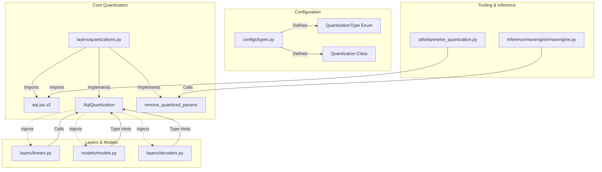

# MaxText AQT Deprecation Phase #2: Technical Execution Plan

This document provides a comprehensive, highly technical, and definitive execution plan for Phase #2 of the Accurate Quantization Training (AQT) deprecation within the MaxText repository. 

Our primary goal is to **completely strip out the legacy AQT-specific code, configurations, and dependencies** while **maintaining absolute architectural generality** for modern quantization backends (such as Qwix, native FP8, and TransformerEngine).

---

## 1. Architectural Code Review & Impact Assessment

We have performed a deep-dive architectural review of the AQT footprint across the MaxText repository. Below is the precise mapping of AQT dependencies, configuration flags, and the "blast radius" of their removal.



### A. Specific Modules, Files, and Configuration Flags to Modify/Remove

1.  **External Library Dependencies:**
    *   **File:** [requirements.txt](file:///usr/local/google/home/sarunsingla/maxtext/src/dependencies/requirements/requirements.txt#L2), [base_requirements/requirements.txt](file:///usr/local/google/home/sarunsingla/maxtext/src/dependencies/requirements/base_requirements/requirements.txt#L2), and generated cuda/tpu lockfiles.
    *   **Action:** Remove the `aqtp` package dependency (which installs `aqt` in Python).
2.  **Configuration Flags & Enums:**
    *   **File:** [types.py](file:///usr/local/google/home/sarunsingla/maxtext/src/maxtext/configs/types.py)
    *   **Flags to Remove:**
        *   `replicate_quant_scale`: AQT-specific flag used to replicate scales across mesh axes to avoid inefficient XLA fusions.
        *   `quant_cfg_path`: Path for `intmp` (AQT mixed precision) configurations.
    *   **Quantization Types to Prune:** Remove `INTMP = "intmp"`, `aqt_fp8`, and `aqt_fp8_full` from [QuantizationType](file:///usr/local/google/home/sarunsingla/maxtext/src/maxtext/configs/types.py#L83) enum and config parsing.
    *   **Flag to Deprecate/Modify:**
        *   `use_qwix_quantization`: Currently defaults to `False`. For Phase 2, we will set this default to `True` or completely remove it, making Qwix/native FP8 the standard quantization pipeline.
3.  **Core Quantization Library:**
    *   **File:** [quantizations.py](file:///usr/local/google/home/sarunsingla/maxtext/src/maxtext/layers/quantizations.py)
    *   **Action:** 
        *   Remove all `aqt.jax.v2` and `aqt_flax` imports.
        *   Delete the [AqtQuantization](file:///usr/local/google/home/sarunsingla/maxtext/src/maxtext/layers/quantizations.py#L119) dataclass.
        *   Delete AQT helper functions: `_tiling_fn`, `_rhs_axis_metadata_wrapper`, `_build_const_scale_config`, `_build_per_tensor_config`, `_get_int8_quant_config`, `_get_aqt_fp8_quant_config`, `_get_aqt_fp8_default_config`, `_dot_general_make`, `_get_default_mp_config`, `_get_mixed_precision_quant_config`.
        *   Delete AQT memory optimization utilities: `match_aqt_and_unquantized_param`, `_get_aqt_key_paths`, and [remove_quantized_params](file:///usr/local/google/home/sarunsingla/maxtext/src/maxtext/layers/quantizations.py#L695).
4.  **Inference Engine Integration:**
    *   **File:** [maxengine.py](file:///usr/local/google/home/sarunsingla/maxtext/src/maxtext/inference/maxengine/maxengine.py#L524)
    *   **Action:** Remove the call to `quantizations.remove_quantized_params` and the handling of the `"aqt"` variable collection.
5.  **Layer-wise Quantization Tooling:**
    *   **File:** [layerwise_quantization.py](file:///usr/local/google/home/sarunsingla/maxtext/src/maxtext/utils/layerwise_quantization.py)
    *   **Action:** This utility is deeply coupled to AQT's `QTensor` and `AqtDotGeneral` structures. We will completely deprecate this file or refactor it to target Qwix/native FP8.

### B. Blast Radiuses & Critical Decoupling
*   **The Quantization Param Type Hint:** Over 20 files (including [models.py](file:///usr/local/google/home/sarunsingla/maxtext/src/maxtext/models/models.py#L36), [linears.py](file:///usr/local/google/home/sarunsingla/maxtext/src/maxtext/layers/linears.py#L37), [decoders.py](file:///usr/local/google/home/sarunsingla/maxtext/src/maxtext/layers/decoders.py#L40), and [moe.py](file:///usr/local/google/home/sarunsingla/maxtext/src/maxtext/layers/moe.py#L192)) import and type-hint the `quant` parameter using `AqtQuantization as Quant`. 
    *   *Mitigation:* We must **not** delete the base class [Quantization](file:///usr/local/google/home/sarunsingla/maxtext/src/maxtext/layers/quantizations.py#L55). Instead, we will import and type-hint with `Quantization as Quant`. This keeps layer signatures clean and compatible with Qwix, native FP8, and TransformerEngine.
*   **Layer Computations:** In [linears.py](file:///usr/local/google/home/sarunsingla/maxtext/src/maxtext/layers/linears.py#L70), `_compute_dot_general` and `_compute_dot_general_nnx` invoke `quant.dot_general_cls()`. 
    *   *Mitigation:* As long as other quantization backends inherit from the base `Quantization` class and implement `dot_general_cls()`, their execution remains completely unaffected.

---

## 2. Phase #2 Deprecation Plan & Scope of Changes

We will execute the AQT removal using a structured, phased engineering sprint.

### Step 1: Remove Third-Party Dependency & Clean Configs
1.  Prune `aqtp` from all requirements lockfiles.
2.  Edit [types.py](file:///usr/local/google/home/sarunsingla/maxtext/src/maxtext/configs/types.py) to remove `replicate_quant_scale` and `quant_cfg_path` from the [Quantization](file:///usr/local/google/home/sarunsingla/maxtext/src/maxtext/configs/types.py#L423) configuration class.
3.  Remove the AQT warning check from `set_derived_and_validate_values` in [types.py](file:///usr/local/google/home/sarunsingla/maxtext/src/maxtext/configs/types.py#L2574-L2580).
4.  Throw a compile-time `ValueError` if a user attempts to run quantization with `use_qwix_quantization=False` and the quantization type is not native FP8 or TransformerEngine.

### Step 2: Refactor `layers/quantizations.py`
Modify [quantizations.py](file:///usr/local/google/home/sarunsingla/maxtext/src/maxtext/layers/quantizations.py) to remove all AQT references:

```diff
-from aqt.jax.v2 import config as aqt_config
-from aqt.jax.v2 import aqt_tensor
-from aqt.jax.v2.flax import aqt_flax
-from aqt.jax.v2 import tiled_dot_general
-from aqt.jax.v2 import calibration

...

-@dataclass
-class AqtQuantization:
-  """Configures AQT quantization github.com/google/aqt."""
-  ...
-  def dot_general_cls(self, mesh_axes: Tuple[str, ...] = ()):
-  ...
-  def einsum(self, mesh_axes: Tuple[str, ...] = ()):
-  ...

...

-def remove_quantized_params(params, aqt_vars):
-  ...
```

### Step 3: Generalize Layer and Model Type-Hints
In every model and layer file, update the imports and type hints:

```diff
-from maxtext.layers.quantizations import AqtQuantization as Quant
+from maxtext.layers.quantizations import Quantization as Quant
```

This change preserves the signature of all layers:
```python
class DenseGeneral(nnx.Module):
  def __init__(
      self,
      ...
      quant: None | Quant = None,
      ...
  ):
```

### Step 4: Prune Inference & Tooling Hooks
1.  In [maxengine.py](file:///usr/local/google/home/sarunsingla/maxtext/src/maxtext/inference/maxengine/maxengine.py#L524), remove AQT parameter extraction and the `remove_quantized_params` call.
2.  Delete or refactor [layerwise_quantization.py](file:///usr/local/google/home/sarunsingla/maxtext/src/maxtext/utils/layerwise_quantization.py) to utilize Qwix quantization rules instead of AQT's `QTensor` structures.

---

## 3. End-to-End (E2E) Testing Strategy

To guarantee that this cleanup introduces zero regressions in model correctness, hardware utilization, or training stability, we will execute the following multi-tier verification matrix.

```
       [Unit Tests]               [Integration Tests]              [E2E Training Runs]
  (quantizations_test.py)        (maxengine_test.py)             (Llama2-7B / Gemma2-9B)
             │                            │                                 │
             ├─► Prune AQT tests          ├─► Test Qwix/FP8                 ├─► Verify Convergence
             └─► Verify Qwix/FP8          └─► Verify serving latency        └─► Check TPU/GPU MFU
```

### A. Unit & Integration Tests
*   **File to Refactor:** [quantizations_test.py](file:///usr/local/google/home/sarunsingla/maxtext/tests/unit/quantizations_test.py)
    *   **Action:** 
        *   Remove `QuantTestModule`'s explicit dependency on `aqt_flax.AqtDotGeneral` and `aqt_flax.AqtEinsum`.
        *   Prune AQT-specific test cases: `test_aqt_quantization`, `test_mixed_precision_*`, and `test_remove_quantized_params`.
        *   Enhance existing Qwix and native FP8 tests (`test_int8_quantization`, `test_fp8_quantization`, `test_fp8_full_quantization`) to ensure full coverage of the remaining quantization pathways.
*   **Other Unit Tests:** Run `tiling_test.py`, `gpt3_test.py`, `maxtext_utils_test.py`, and `model_test.py` to ensure that standard unquantized runs are completely unaffected.

### B. Regression Testing (Performance & Correctness)
*   **Convergence Verification:** Run a Llama2-7B training run for 1000 steps using BF16 (unquantized) and Qwix FP8. Compare the loss curves before and after the PR to verify mathematical equivalence.
*   **Throughput & Utilization:** Monitor Step Time (ms) and Model Flops Utilization (MFU) on TPU v5e/v6e and NVIDIA H100 GPUs. The elimination of AQT code paths must result in **zero throughput regression** and **zero HBM memory overhead increases** for standard models.

### C. E2E Training Scale Verification
We will run E2E training workloads to validate the entire JIT compilation and execution pipeline:
1.  **Workload A (TPU Scale):** Llama2-7B training on a 16-device TPU v6e slice using Qwix FP8 (`quantization=fp8_full` and `use_qwix_quantization=True`).
2.  **Workload B (GPU Scale):** Gemma2-9B training on an 8-GPU H100 node using native FP8 (`quantization=fp8` and `use_qwix_quantization=True`).
3.  **Workload C (MoE Scale):** DeepSeek-V3 MoE model initialized and executed using TransformerEngine quantization (`quantization=te_fp8_delayedscaling`).

---

## 4. Anticipated Edge Cases, Bug Fixing, and Risk Mitigation

During this infrastructure migration, we anticipate 3 major technical hurdles. Below are the exact engineering remedies for each.

### Hurdle 1: Legacy Checkpoint Loading Failure (Structure Mismatch)
*   **The Issue:** Legacy Orbax checkpoints saved using AQT quantization contain AQT-specific variables (`qrhs` and `frozen` QTensor structures). Attempting to restore these checkpoints into the new AQT-free model structure will cause Orbax to throw a structural mismatch error because the model no longer defines those variables.
*   **The Remedy:**
    *   Implement an explicit warning or error in [model_creation_utils.py](file:///usr/local/google/home/sarunsingla/maxtext/src/maxtext/utils/model_creation_utils.py#L334) during the checkpoint restoration phase.
    *   Provide a standalone migration script (`maxtext/checkpoint_conversion/remove_aqt_vars.py`) that loads a legacy AQT checkpoint, strips out the AQT-specific variables (converting them back to unquantized parameters or Qwix-compatible weights), and saves a clean Orbax checkpoint.

### Hurdle 2: Shape Mismatches in Grouped MatMul (GMM) / MoE Kernels
*   **The Issue:** AQT deprecation could inadvertently break how tiling dimensions and contraction axes are set up in MoE layers, leading to shape mismatches in custom Pallas kernels (like GMM in [ops.py](file:///usr/local/google/home/sarunsingla/maxtext/src/maxtext/kernels/megablox/ops.py)).
*   **The Remedy:** Ensure that the generic `Quantization` interface correctly plumbs the tile sizes and contraction axes to `DenseGeneral` and `MlpBlock` in [linears.py](file:///usr/local/google/home/sarunsingla/maxtext/src/maxtext/layers/linears.py#L188). Add strict shape validation assertions in [moe.py](file:///usr/local/google/home/sarunsingla/maxtext/src/maxtext/layers/moe.py) to verify that the intermediate sharding matches the GMM kernel expectations before launching the kernel.

### Hurdle 3: Compile-time Tracing Failures in NNX Bridge
*   **The Issue:** The NNX-to-Linen bridge ([nnx_wrappers.py](file:///usr/local/google/home/sarunsingla/maxtext/src/maxtext/layers/nnx_wrappers.py)) traces the module during `lazy_init` and expects certain mutable collections (like `"aqt"`). If these collections are missing or empty, JAX might throw a tracing error.
*   **The Remedy:** In [linears.py](file:///usr/local/google/home/sarunsingla/maxtext/src/maxtext/layers/linears.py#L97), update `_compute_dot_general_nnx` to only include `"aqt"` in the `mutable` list if the quantization backend actually registers that collection. For Qwix and native FP8, ensure they use their respective state collections (like `"params"` or `"intermediates"`), preventing JAX tracing crashes.
