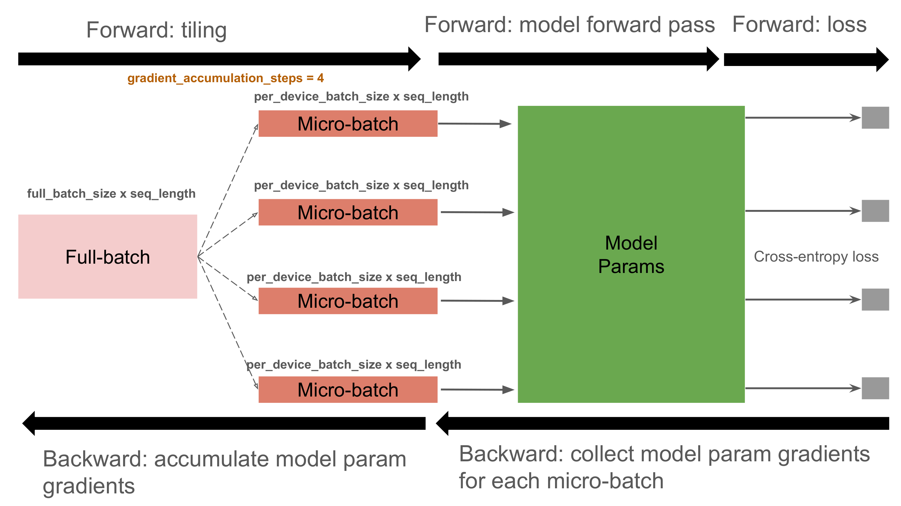
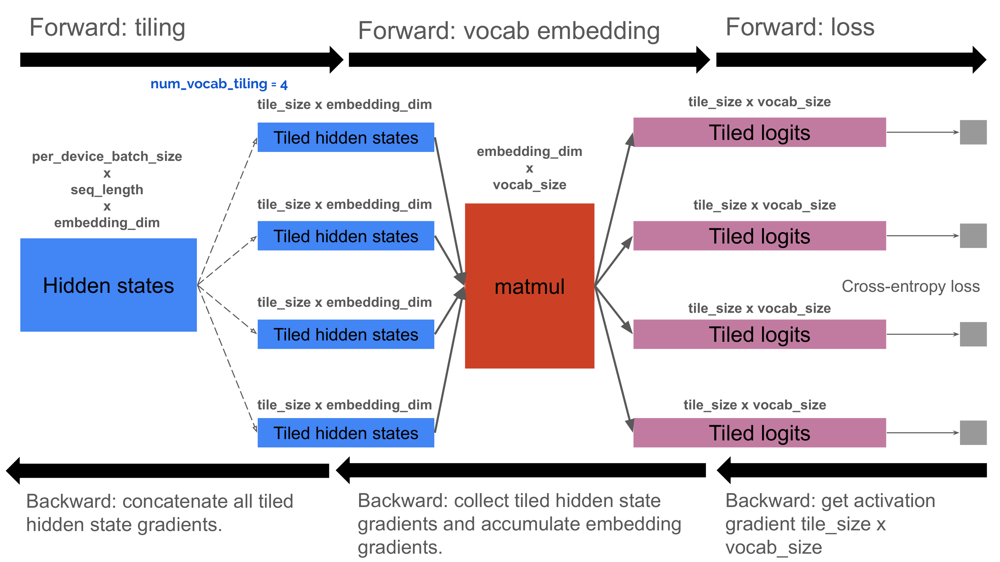

<!--
 Copyright 2025 Google LLC

 Licensed under the Apache License, Version 2.0 (the "License");
 you may not use this file except in compliance with the License.
 You may obtain a copy of the License at

      https://www.apache.org/licenses/LICENSE-2.0

 Unless required by applicable law or agreed to in writing, software
 distributed under the License is distributed on an "AS IS" BASIS,
 WITHOUT WARRANTIES OR CONDITIONS OF ANY KIND, either express or implied.
 See the License for the specific language governing permissions and
 limitations under the License.
 -->

# Tiling

Often in high-performance computing, there's a trade-off between memory usage and computation time. **Tiling** (also known as chunking) is an optimization technique that prioritizes reducing memory usage, but sometimes at a cost to running time.

The core idea is to partition a large tensor into smaller, more manageable blocks called **tiles**. Instead of loading the entire tensor into memory, a program processes these tiles sequentially. This significantly lowers the peak memory required to perform an operation.

While processing data in chunks can introduce minor computational overhead, an efficient tiling strategy minimizes this cost. By preventing out-of-memory errors, tiling enables programs to handle larger problems than would otherwise be possible. This often leads to better hardware utilization and improved end-to-end performance metrics, such as MFU.

## The Concept of Tiling

The effectiveness of tiling stems from the **linearity** of many operations in LLMs. Operations like matrix multiplication and gradient calculation can be broken down into smaller, independent sub-problems.

For instance, consider the matrix multiplication operation:

$$A[M, N] \times B[N, 1] = C[M, 1]$$

If the matrices `A` is too large to fit into memory, you can tile the operation. By splitting matrix `A` into $K$ smaller chunks along its `M` dimension ($A_0[M/K, N], \dots, A_{K-1}[M/K, N]$), you can load each chunk separately and compute a corresponding portion of the output matrix `C` ($C_0[M/K, 1], \dots, C_{K-1}[M/K, 1]$) follows

$$A_i[M/K, N]\times B[N, 1] = C_i[M/K, 1] \quad \forall i=0, \dots, K-1.$$

Finally, you can concatenate the smaller `C` matrices to form the complete result.

This principle extends to the backward pass as well. Instead of computing the full gradient `dA[M, N]`, which also exceeds memory capacity, you can compute the gradient for each tile individually:

$$dC_i[M/K, 1] \times B^\intercal[1, N] = dA_i[M/K, N] \quad \forall i=0,\dots,K-1.$$

Similarly, the gradient on `B` is the accumulation

$$\sum_{i=0}^{K-1}dC_i^\intercal[1, M/K] \times A_i[M/K, N] = dB[N, 1] \quad \forall i=0,\dots,K-1.$$

This tiling approach reduces the peak memory usage from $\mathcal{O}(MN)$ to $\mathcal{O}(MN/K)$, which facilitates model training with limited memory resources. 

## Tiling in MaxText

### Gradient Accumulation

Gradient accumulation (GA) is a form of tiling that splits a full data batch into smaller micro-batches.

In MaxText, the `gradient_accumulation_steps` config determines the number of micro-batches. When this is set, `per_device_batch_size` effectively becomes the size of each micro-batch. During training, the model processes one micro-batch at a time, and the resulting gradients are accumulated. A full parameter update occurs only after all micro-batches have been processed.

GA reduces the size of activations in memory at any given moment, which is crucial for training with large batch sizes or when using sharding strategies like pipeline parallelism.

*Figure 1: Gradient accumulation tiles a global batch into smaller micro-batches.*

### Vocabulary Tiling

Vocabulary tiling is another memory-saving technique designed to handle the large vocabulary sizes in modern language models.

The final output unembedding layer of a language model maps hidden states to logits—a large tensor of scores with a shape of `[per_device_batch_size, seq_length, vocab_size]`. This tensor can be enormously large and cause out-of-memory errors.

Vocabulary tiling avoids materializing the full logits tensor. Instead, it tiles the input hidden states and computes the logits, loss, and gradients one tile at a time. Unlike GA, which is applied at the start of the model, vocabulary tiling is applied only to the input of the final layer.

In MaxText, the `num_vocab_tiling` configuration controls the number of tiles. This technique is especially advantageous for models with large vocabularies (e.g., Gemma and Llama), particularly when training with long sequence lengths. By preventing out-of-memory errors, vocabulary tiling can enable simpler sharding strategies (like FSDP) and unlock better computational performance.

*Figure 2: Vocabulary tiling processes hidden states in tiles to avoid generating the full logits tensor.*

### Other Tiling Methods

Tiling is also crucial for managing data movement across the memory hierarchy (HBM, VMEM, VREGs). It's applied at various levels: manually within low-level custom operations like Pallas kernels (e.g., Splash Attention) to precisely control HBM to VMEM transfers, and automatically by the XLA compiler for standard computations such as matrix multiplications. This hierarchical approach of breaking data into smaller, manageable tiles ensures efficient hardware utilization by pipelining data through stages.

## Tiling vs. Sharding

**Tiling** and **sharding** are independent concepts that do not conflict; in fact, they are often used together. Sharding distributes a tensor across multiple devices, while tiling processes a tensor in chunks on the same device. 

To learn more about sharding in MaxText, please refer to the [sharding documentation](https://maxtext.readthedocs.io/en/latest/explanations/sharding.html).