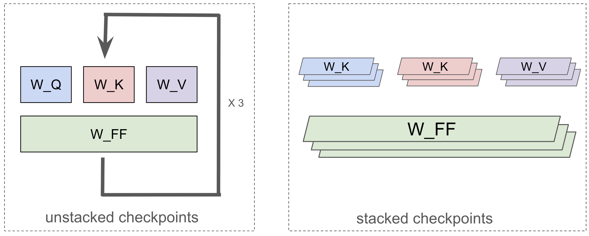

<!--
 Copyright 2024 Google LLC

 Licensed under the Apache License, Version 2.0 (the "License");
 you may not use this file except in compliance with the License.
 You may obtain a copy of the License at

      https://www.apache.org/licenses/LICENSE-2.0

 Unless required by applicable law or agreed to in writing, software
 distributed under the License is distributed on an "AS IS" BASIS,
 WITHOUT WARRANTIES OR CONDITIONS OF ANY KIND, either express or implied.
 See the License for the specific language governing permissions and
 limitations under the License.
 -->

# Checkpoints

## Checkpoint Formats

Checkpoint formats in MaxText can be categorized along two axes: whether they include **training states** (e.g., optimizer properties) and whether the model's parameter weights are **stacked** or **unstacked** (aka scanned/unscanned). This results in the four types summarized below:

|                           | **Unstacked Weights**  | **Stacked Weights**  |
| :------------------------ | :------------------------------------- | :-------------------------------------- |
| **Without Train State**   | Unstacked Inference Checkpoint         | Stacked Inference Checkpoint           |
| **With Train State**      | Unstacked Training Checkpoint          | Stacked Training Checkpoint            |

We discuss these two axes respectively:

### Training States

Checkpoints with a **training state** contain more than just the model's parameter weights. They also include the **optimizer state** (e.g., momentum values), which is essential for resuming a training run exactly where it left off. These "training checkpoints" are typically saved as snapshots during training to allow for recovery if the process is interrupted.

In contrast, **inference checkpoints** contain only the parameter weights. We also call them parameter only/param-only checkpoints. This is the format most commonly used for sharing models on public platforms like HuggingFace, as they are smaller and ready for immediate use in inference or for fine-tuning.

### Stacked Checkpoints and JAX Scan Function 

The concept of stacked vs. unstacked checkpoints is specific to JAX-based models that use the `jax.lax.scan` function ([doc](https://jax.readthedocs.io/en/latest/_autosummary/jax.lax.scan.html)). `scan` is a powerful JAX feature that compiles sequential operations (like the layers of a Transformer) into a single, highly optimized kernel, avoiding the overhead of a Python for-loop.

To work with `jax.lax.scan`, the model's parameters must be "stacked". For a Transformer model, this means that instead of storing parameters layer-by-layer, similar parameters from all layers are grouped (stacked) together. Figure 1 illustrates the difference:

1. **Unstacked Checkpoints**: Parameters for each layer are stored in separate groups (e.g., `layers_0`, `layers_1`, `layers_2`). This is the common format for models released publicly. (Figure 1, left).
2. **Stacked Checkpoints**: Corresponding parameters from all layers are combined into a single, larger tensor (e.g., all attention weights are in one array). This is the format `jax.lax.scan` expects. (Figure 1, right).


*Figure 1: A comparison of an unstacked checkpoint and a stacked checkpoint for a simple language model.*

Their difference can also be represented in the following pytree structure:
```
# Stacked (aka scanned)
"params" : {
"mlp_0" : [num_layers, emb_d, ff_d]
"mlp_1" : [num_layers, ff_d, emb_d]
}

# Unstacked
"params" {
{"layer_0":
   "mlp_0" : [ emb_d, ff_d]
    "mlp_1"" : [ff_d, emb_d]
"layer_1"
...
}
```

The stacked format is highly efficient but has one key requirement: all layers within the `scan` operation must have identical configurations. For models with heterogeneous layers (where layer configurations differ), stacking is not possible, and only unstacked checkpoints can be used.

### Takeaways

To summarize the four checkpoint types:

- **Unstacked Inference Checkpoint:** The standard format for publicly released models (e.g., on HuggingFace). Contains only model weights, stored layer-by-layer. Ideal for starting new training runs or for inference.
- **Unstacked Training Checkpoint:** Contains weights and optimizer state, stored layer-by-layer. Used to resume training for models that do not use `jax.lax.scan` (e.g., models with non-identical layers).
- **Stacked Inference Checkpoint:** Contains only model weights, but they are stacked for `scan`-compatible inference. Created by stripping the optimizer state from a stacked training checkpoint.
- **Stacked Training Checkpoint:** The default format for saving and resuming training runs within MaxText. Contains both weights and optimizer state in a stacked format, optimized for `jax.lax.scan`.

In MaxText, we treat **Stacked Inference Checkpoints** as the default format for checkpoint conversion. For *saving and resuming* training, MaxText uses **Stacked Training Checkpoints** by default. 

---

## Using Checkpoints in Practice

Beyond understanding the formats, it's crucial to know how to use checkpoints in your training workflows. MaxText uses flags in the configuration file or on the command line to manage checkpoints.

### Saving Checkpoints During Training

MaxText automatically saves checkpoints periodically during a training run. These are **Stacked Training Checkpoints** that contain the full state needed to resume.

-   `base_output_directory`: Specifies the GCS bucket directory where checkpoints will be saved.
-   `enable_checkpointing`: A boolean to enable or disable checkpointing.
-   `async_checkpoint`: Support training and checkpoint saving at the same time.
-   `checkpoint_period`: The interval, in training steps, at which to save a new checkpoint.

Furthermore, MaxText supports emergency checkpointing, which saves a local copy of the checkpoint that can be restored quickly after an interruption.

-   `enable_emergency_checkpoint`: A boolean to enable or disable this feature.
-   `local_checkpoint_directory`: The local path for storing emergency checkpoints.
-   `local_checkpoint_period`: The interval, in training steps, for saving local checkpoints.

More configs about checkpoints can be found in [here](https://github.com/AI-Hypercomputer/maxtext/blob/518a87037abb2497a2514ff0c8ffc263c69c6f9f/MaxText/configs/base.yml#L23-L65).
