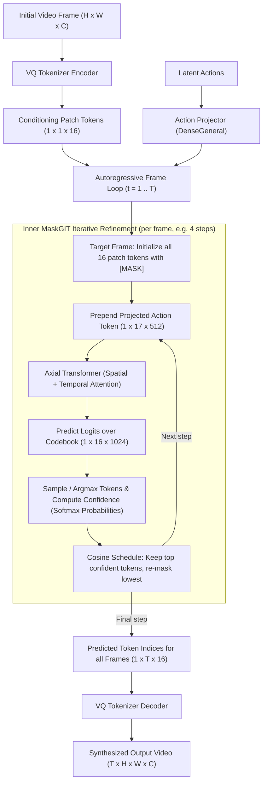

# Jasmine MaskGIT Dynamics Model Bring-up in MaxText

This document details the architecture, generative mechanism, and integration of the Jasmine MaskGIT dynamics model into MaxText using **Flax NNX** and MaxText's optimized attention layers. It serves as a comprehensive guide for the model architecture, generative pipeline, key implementation decisions, and troubleshooting steps resolved during the bring-up process.

---

## 1. Generative Paradigm: MaskGIT vs. Diffusion

A central design choice of Jasmine-MaskGIT is that it **does NOT use a continuous diffusion block** (i.e. no continuous Gaussian noise schedules, DDPM/DDIM reverse ODE/SDE solvers, or diffusion score-matching loss).

Instead, it operates under the **discrete Masked Generative Image/Video Transformer (MaskGIT)** paradigm:
1. **Discrete Representation**: Visual frames are quantized into discrete categorical tokens via a pretrained visual Vector-Quantized (VQ) Tokenizer.
2. **Action Conditioning**: Latent action tokens from a Latent Action Model (LAM) are projected and prepended to the visual spatial tokens.
3. **Spatiotemporal Dynamics Backbone**: An **Axial Transformer** with factorized 2D attention (spatial bidirectional + temporal causal) models the joint distribution of visual tokens conditioned on past frames and actions.
4. **Hierarchical Decoding**: Generates future frames sequentially across time (causal autoregressive frame rollout) while predicting spatial tokens within each frame in parallel via iterative MaskGIT confidence-based refinement.
5. **Pixel Synthesis**: The final sampled discrete token indices are decoded back into continuous RGB video frames using the pretrained VQ decoder.



---

## 2. Architecture Overview

The integrated model components reside in MaxText at:
*   [`jasmine.py`](file:///home/hengtaoguo_google_com/projects/maxtext/src/maxtext/models/jasmine.py): Model definition (`DynamicsMaskGIT`, `AxialTransformer`, `AxialBlock`, `sample` loop).
*   [`vla_decode.py`](file:///home/hengtaoguo_google_com/projects/maxtext/src/maxtext/inference/vla_decode.py): Tokenization, action encoding, sampling orchestration, and VQ decoding.
*   [`vla_decode_test.py`](file:///home/hengtaoguo_google_com/projects/maxtext/tests/unit/vla_decode_test.py): Model unit test suite.
*   [`jasmine_maskgit_forward_shapes.md`](file:///home/hengtaoguo_google_com/projects/maxtext/docs/guides/jasmine_maskgit_forward_shapes.md): Detailed tensor shape specifications and axial reshape mappings.

### Model Components

The top-level NNX module `DynamicsMaskGIT` contains:
1.  **Patch Embedder**: `nnx.Embed` mapping discrete vocabulary token indices ($V = 1024$) to model dimension ($d_{\text{model}} = 512$).
2.  **Mask Token**: Learned parameter `self.mask_token` of shape `(1, 1, 1, d_model)` substituted for masked positions.
3.  **Action Projector**: `maxtext.layers.linears.DenseGeneral` mapping latent action dimensions to $d_{\text{model}} = 512$.
4.  **Spatiotemporal Axial Transformer**: `AxialTransformer` containing a stack of `AxialBlock` layers:
    *   **Spatial Attention**: Applies bidirectionally across the spatial dimension ($N+1 = 17$ tokens: 1 action + 16 image patches) within each frame.
    *   **Temporal Attention**: Applies causally across the temporal dimension ($T = 16$ frames across time).
    *   **Feedforward Block (FFN)**: Two `DenseGeneral` layers with GeLU activation projecting $d_{\text{model}} \to d_{\text{ffn}} (2048) \to d_{\text{model}} (512)$.

---

## 3. Detailed Sampling & Generation Flow

The generation logic in [`DynamicsMaskGIT.sample`](file:///home/hengtaoguo_google_com/projects/maxtext/src/maxtext/models/jasmine.py#L327) follows a hierarchical double-scan loop executed via `jax.lax.scan`:

### 1. Outer Frame Loop (`generation_step_fn`)
Scans causally across timesteps $t \in [T_{\text{start}}, T_{\text{seq}})$. For each target frame $t$:
*   All $N = 16$ spatial token slots at timestep $t$ are masked (`mask_token`).
*   The frame is passed to the inner MaskGIT loop for parallel iterative unmasking.

### 2. Inner MaskGIT Refinement Loop (`maskgit_step_fn`)
Iterates for a fixed number of steps $K$ (e.g. `maskgit_steps = 4` or `25`):
1.  **Token Embedding & Action Injection**: Combines masked frame embeddings with the projected action token for timestep $t$.
2.  **Forward Pass**: The `AxialTransformer` processes the $[B, T, N+1, d_{\text{model}}]$ sequence and predicts categorical logits $[B, T, N, V]$ over the codebook vocabulary.
3.  **Categorical Sampling**: Discrete tokens are sampled or selected greedily (`sample_argmax=True`) from temperature-scaled logits.
4.  **Confidence Computation**: Gathers the softmax probability of each sampled token as its confidence score.
5.  **Cosine Masking Schedule**: Computes the unmasked token ratio according to:
    $$\text{unmasked\_ratio} = \cos\left(\frac{\pi (k + 1)}{2 \cdot K}\right)$$
    The top $\lceil N \cdot (1 - \text{unmasked\_ratio}) \rceil$ most confident predictions are preserved; the remaining lower-confidence positions are re-masked for the next MaskGIT step.

### 3. VQ Token-to-Pixel Decoding
After all future frames have been generated in discrete token space ($[B, T, N]$), the full sequence of token indices is decoded by `jasmine_model.tokenizer.decode`, reconstructing continuous $[B, T, H, W, C]$ RGB frames.

---

## 4. Key Porting Details & Pitfalls

During porting into MaxText, several challenges related to JAX tracing, parameter scaling, and NNX state structure were identified and resolved:

### 1. Logits Scaling in MaxText Attention
*   **Pitfall**: Standard multi-head attention scales attention logits by $1/\sqrt{d_k}$ (where $d_k$ is the head dimension) before applying softmax. MaxText's optimized `Attention` layer defaults to **no scaling** (scalar value of `1.0`) unless explicitly configured. Without this scaling, logits are too large, leading to an extremely sharp softmax distribution. During MaskGIT sampling, this caused the model to aggressively predict the mask token (index `0`) for almost all locations.
*   **Solution**: We explicitly passed `query_pre_attn_scalar=head_dim**-0.5` to both spatial and temporal `Attention` constructors. This restored standard scaled dot-product attention and fixed generation quality.

### 2. Attention Output Interface
*   **Pitfall**: Flax Linen's standard `nn.MultiHeadAttention` returns a single output array. MaxText's optimized `Attention` layer always returns a tuple: `(output, kv_cache)`.
*   **Solution**: When calling attention inside `AxialBlock.__call__`, we explicitly unpack the returned tuple and discard the `kv_cache`:
    ```python
    z_flat_spatial, _ = self.spatial_attention(z_flat_spatial, z_flat_spatial, model_mode=MODEL_MODE_TRAIN)
    ```

### 3. Static Shape Requirements for Compilation
*   **Pitfall**: Unlike standard Flax NNX layers which infer shapes dynamically, MaxText's `Attention` layer compiles highly optimized hardware kernels (e.g. Flash Attention, Pallas) which require static shapes at constructor time (`__init__`).
*   **Solution**: We modified `AxialBlock` and `AxialTransformer` constructors to accept static parameters `num_spatial_patches` (N) and `temporal_seq_len` (T). We passed dummy shapes `(1, 1, d_model)` to `inputs_q_shape` and `inputs_kv_shape` to satisfy the constructor's shape initialization needs for projection layers:
    ```python
    self.spatial_attention = Attention(
        ...
        max_target_length=num_spatial_patches,  # N (e.g., 16)
        inputs_q_shape=(1, 1, self.dim),
        inputs_kv_shape=(1, 1, self.dim),
    )
    ```

### 4. JAX Initialization Order Conflicts
*   **Pitfall**: Calling JAX operations (like `jax.devices()`) before initializing MaxText's configurations locks the JAX backend. If `pyconfig.initialize()` is called later, JAX throws a `RuntimeError: JAX backend already initialized`.
*   **Solution**: In the evaluation script (`src/maxtext/inference/vla_decode.py`), `pyconfig.initialize` must be called at the absolute beginning of `main()`, preceding any other library imports or JAX operations.

### 5. In-Memory Weight Copying (No Intermediate Pickle Files)
*   **Pitfall**: Standard checkpoint restore mechanisms mapping Linen to NNX require writing offline conversion scripts. Since both the source model (Jasmine) and target model (MaxText port) are NNX models, we can load them in-memory. However, running JAX's native `tree_flatten` on `nnx.State` flattens *past* the `nnx.Variable` wrappers, returning immutable JAX arrays as leaves, which prevents in-place mutation.
*   **Solution**: We implemented a custom recursive flattener that stops traversing at `nnx.Variable` objects. This allows us to map and load parameter values directly in-place:
    ```python
    def flatten_state(s, prefix=()):
        flat = {}
        from flax.nnx.statelib import State
        if isinstance(s, (State, dict)):
            for k, v in s.items():
                flat.update(flatten_state(v, prefix + (k,)))
        elif isinstance(s, nnx.Variable):
            flat[prefix] = s
        return flat

    # Assign in-place with coordinate casting
    for path_tuple, var in flat_maxtext.items():
        if path_tuple in flat_jasmine:
            var[...] = jnp.asarray(flat_jasmine[path_tuple][...], dtype=var[...].dtype)
    ```

---

## 5. How to Run & Configure

### Execution
The entry point script resides inside the inference directory. Run it from the repository root:
```bash
python3 src/maxtext/inference/vla_decode.py checkpoint=/path/to/jasmine/ckpt maskgit_steps=4 temperature=1.0 sample_argmax=true
```

### Running Unit Tests
A unit test suite has been added to verify model shape configuration and JIT-compilation correctness:
```bash
PYTHONPATH=/home/hengtaoguo_google_com/projects/maxtext python3 tests/unit/vla_decode_test.py
```

### VS Code Debugger Configuration
Add this configuration to your `.vscode/launch.json` to debug the script:
```json
        {
            "name": "maxtext_jasmine_decode",
            "type": "debugpy",
            "request": "launch",
            "python": "/home/hengtaoguo_google_com/projects/venv3/bin/python",
            "cwd": "/home/hengtaoguo_google_com/projects/maxtext",
            "program": "/home/hengtaoguo_google_com/projects/maxtext/src/maxtext/inference/vla_decode.py",
            "justMyCode": false,
            "env": {
                "PYTHONPATH": "/home/hengtaoguo_google_com/projects/maxtext/src:/home/hengtaoguo_google_com/projects/jasmine",
                "JAX_PLATFORMS": "cpu"
            },
            "args": [
                "checkpoint=/home/hengtaoguo_google_com/projects/checkpoints/jasmine-maskgit-coinrun",
                "maskgit_steps=4",
                "temperature=1.0",
                "sample_argmax=true",
                "seed=0"
            ],
            "console": "integratedTerminal"
        }
```

---

## 6. Metrics Validation

Correctness is validated by comparing the output generation of the MaxText NNX port against the baseline Jasmine implementation on the same CoinRun episode:

| Model / Run | Attention Implementation | Style | SSIM (Avg) | PSNR (Avg) |
| :--- | :--- | :--- | :--- | :--- |
| **Jasmine Baseline** (NNX) | NNX Attention | NNX | `0.8514` | `27.16` |
| **MaxText Linen Port** | MaxText `Attention` | Linen | `0.8691` | `28.22` |
| **MaxText NNX Port** (Integrated) | MaxText `Attention` | **NNX** | **`0.8691`** | **`28.22`** |

The exact parity of the metrics confirms the architectural correctness of the ported layers and weight mapping.
