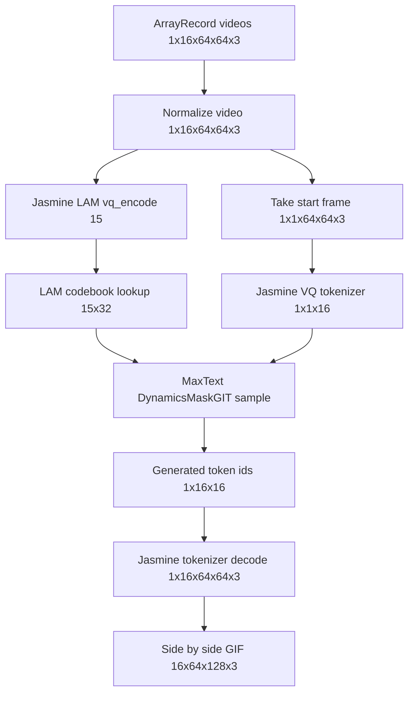
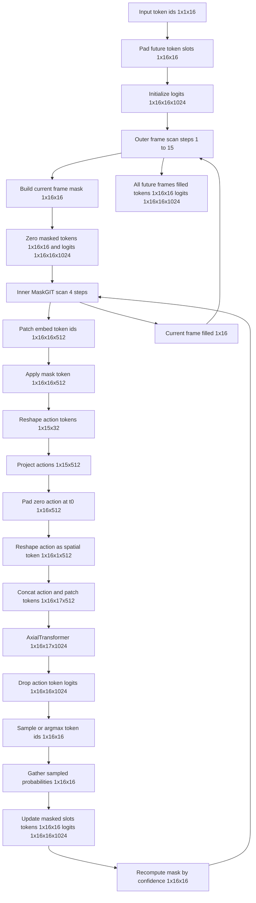
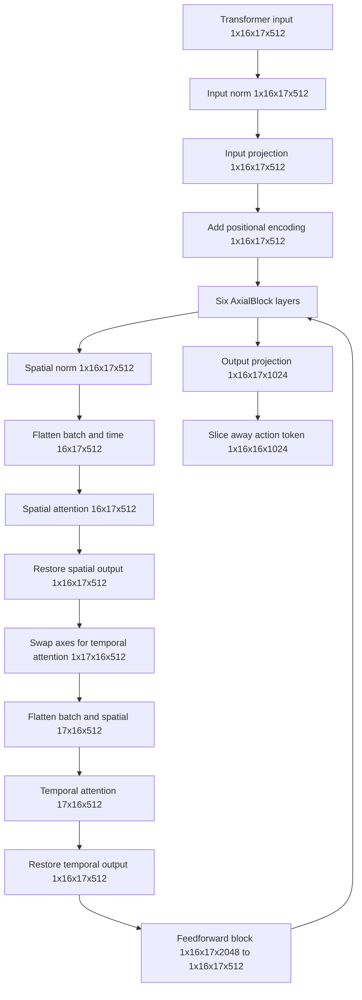
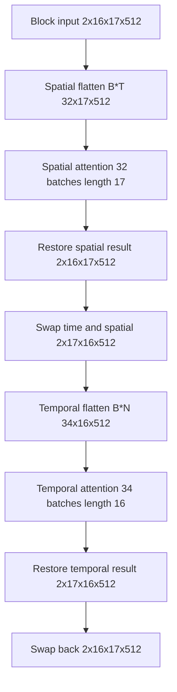

# Jasmine MaskGIT Forward Shape Map

This note documents the tensor sizes for the current MaskGIT route used by
`src/maxtext/inference/vla_decode.py`. The sizes below use the checked-in
defaults:

| Name | Value | Source |
| --- | ---: | --- |
| Batch size, `B` | 1 | `Args.batch_size` |
| Full sequence length, `S` | 16 | `Args.seq_len` |
| Conditioning frames, `T` | 1 | `Args.start_frame` |
| Image size, `H x W x C` | `64 x 64 x 3` | `Args.image_height`, `Args.image_width`, `Args.image_channels` |
| Patch size | 16 | `Args.patch_size` |
| Video patches per frame, `N` | 16 | `(64 / 16) * (64 / 16)` |
| Token vocabulary, `V` | 1024 | `Args.num_patch_latents` |
| Dynamics width, `M` | 512 | `Args.dyna_dim` |
| Dynamics FFN width, `D` | 2048 | `Args.dyna_ffn_dim` |
| Latent action width, `L` | 32 | `Args.latent_action_dim` |
| MaskGIT refinement steps | 4 | `Args.maskgit_steps` |

## End-to-End Route

The current MaxText route does not translate the full Jasmine MaskGIT wrapper.
Jasmine still owns pixel/token preprocessing and token/pixel decoding. MaxText
owns the token-space dynamics generation.



| Node | Tensor | Size |
| --- | --- | --- |
| ArrayRecord videos | `batch["videos"]` | `[1, 16, 64, 64, 3]` |
| Normalize video | `gt_video`, `batch["videos"]` | `[1, 16, 64, 64, 3]` |
| Jasmine LAM `vq_encode` | `action_batch_E` | `[15]` |
| LAM codebook lookup | `action_tokens_EL` | `[15, 32]` |
| Take start frame | `batch_videos` | `[1, 1, 64, 64, 3]` |
| Jasmine VQ tokenizer | `token_idxs_BTN` | `[1, 1, 16]` |
| MaxText dynamics sample | `final_token_idxs_BSN`, `final_logits_BSNV` | `[1, 16, 16]`, `[1, 16, 16, 1024]` |
| Jasmine tokenizer decode | `recon_video_BSHWC` | `[1, 16, 64, 64, 3]` |
| Side by side GIF | `frames` | `[16, 64, 128, 3]` |

## Sampling Forward Step

`DynamicsMaskGIT.sample` first pads the one conditioning frame to the requested
sequence length. Then each future frame is generated autoregressively. For every
future frame, the inner MaskGIT loop runs `maskgit_steps=4` refinement passes.



| Node | Tensor | Size |
| --- | --- | --- |
| Input token ids | `token_idxs_BTN` | `[1, 1, 16]` |
| Pad future token slots | `token_idxs_BSN` | `[1, 16, 16]` |
| Initialize logits | `init_logits_BSNV` | `[1, 16, 16, 1024]` |
| Outer frame scan | `step_t` | scalar values `1..15` |
| Build current frame mask | `mask_BSN` | `[1, 16, 16]` |
| Zero masked tokens and logits | `masked_token_idxs_BSN`, `masked_logits_BSNV` | `[1, 16, 16]`, `[1, 16, 16, 1024]` |
| Inner MaskGIT scan | `step` | scalar values `0..3` |
| Patch embed token ids | `vid_embed_BSNM` | `[1, 16, 16, 512]` |
| Apply mask token | `vid_embed_BSNM` | `[1, 16, 16, 512]` |
| Reshape action tokens | `action_tokens_BSm1L` | `[1, 15, 32]` |
| Project actions | `act_embed_BSm1M` | `[1, 15, 512]` |
| Pad zero action at `t=0` | `act_embed_BSM` | `[1, 16, 512]` |
| Reshape action as spatial token | `act_embed_BS1M` | `[1, 16, 1, 512]` |
| Concat action and patch tokens | `vid_embed_BSNp1M` | `[1, 16, 17, 512]` |
| AxialTransformer | `final_logits_BSNp1V` | `[1, 16, 17, 1024]` |
| Drop action token logits | `final_logits_BSNV` | `[1, 16, 16, 1024]` |
| Sample or argmax token ids | `sampled_token_idxs_BSN` | `[1, 16, 16]` |
| Gather sampled probabilities | `final_token_probs_BSN` | `[1, 16, 16]` |
| Update masked slots | `token_idxs_BSN`, `logits_BSNV` | `[1, 16, 16]`, `[1, 16, 16, 1024]` |
| Recompute mask by confidence | `new_mask_BSN` | `[1, 16, 16]` |
| All future frames filled | `final_token_idxs_BSN`, `final_logits_BSNV` | `[1, 16, 16]`, `[1, 16, 16, 1024]` |

## Axial Transformer Internal Shapes

Each MaskGIT refinement pass calls the transformer on
`vid_embed_BSNp1M = [1, 16, 17, 512]`. The extra spatial position is the
prepended action token. The model predicts logits for all 17 positions, then
the action-token position is sliced away.



| Node | Tensor | Size |
| --- | --- | --- |
| Transformer input | `x_BTNI` | `[1, 16, 17, 512]` |
| Input norm | `x_BTNI` | `[1, 16, 17, 512]` |
| Input projection | `x_BTNM` | `[1, 16, 17, 512]` |
| Add positional encoding | `x_BTNM` | `[1, 16, 17, 512]` |
| Spatial norm | `z_BTNM` | `[1, 16, 17, 512]` |
| Flatten batch and time | `z_flat_spatial` | `[16, 17, 512]` |
| Spatial attention | `z_flat_spatial` | `[16, 17, 512]` |
| Restore spatial output | `x_BTNM` | `[1, 16, 17, 512]` |
| Swap axes for temporal attention | `x_BNTM` | `[1, 17, 16, 512]` |
| Flatten batch and spatial | `z_flat_temporal` | `[17, 16, 512]` |
| Temporal attention | `z_flat_temporal` | `[17, 16, 512]` |
| Restore temporal output | `x_BTNM` | `[1, 16, 17, 512]` |
| Feedforward block | `z_BTND`, `x_BTNM` | `[1, 16, 17, 2048]`, `[1, 16, 17, 512]` |
| Output projection | `logits_BSNp1V` | `[1, 16, 17, 1024]` |
| Slice away action token | `patch logits` | `[1, 16, 16, 1024]` |

## One Attention Pass With `batch_size=2`

The transformer keeps the video representation as a 4D tensor:

```text
x_BTNM = [B, T, N+1, M]
       = [2, 16, 17, 512]
```

The MaxText attention layer does not directly attend over a 4D tensor. Each
`AxialBlock` reshapes the tensor into ordinary 3D attention inputs twice: once
for spatial attention, and once for temporal attention.



Spatial attention attends **within one frame**. The reshape is:

```python
z_BTNM = self.spatial_norm(x_BTNM)
B, T, N, M = z_BTNM.shape
z_flat_spatial = z_BTNM.reshape(B * T, N, M)
```

With `B=2`, `T=16`, `N=17`, `M=512`:

```text
[2, 16, 17, 512] -> [32, 17, 512]
```

The attention layer sees `32` independent examples, each with sequence length
`17`. These correspond to:

```text
sample 0, frame 0:  [action, patch0, ..., patch15]
sample 0, frame 1:  [action, patch0, ..., patch15]
...
sample 0, frame 15: [action, patch0, ..., patch15]

sample 1, frame 0:  [action, patch0, ..., patch15]
sample 1, frame 1:  [action, patch0, ..., patch15]
...
sample 1, frame 15: [action, patch0, ..., patch15]
```

Temporal attention attends **across frames for one token slot**. The reshape is:

```python
x_BNTM = x_BTNM.swapaxes(1, 2)
z_BNTM = self.temporal_norm(x_BNTM)
B, N, T, M = z_BNTM.shape
z_flat_temporal = z_BNTM.reshape(B * N, T, M)
```

With `B=2`, `N=17`, `T=16`, `M=512`:

```text
[2, 16, 17, 512]
-> swap time/spatial -> [2, 17, 16, 512]
-> flatten B*N -> [34, 16, 512]
```

The attention layer sees `34` independent examples, each with sequence length
`16`. These correspond to:

```text
sample 0, action-token track across 16 frames
sample 0, patch0 track across 16 frames
...
sample 0, patch15 track across 16 frames

sample 1, action-token track across 16 frames
sample 1, patch0 track across 16 frames
...
sample 1, patch15 track across 16 frames
```

So one `AxialBlock` with `batch_size=2` has this shape summary:

| Operation | Attention input size | Meaning |
| --- | --- | --- |
| Spatial attention | `[32, 17, 512]` | `2 * 16` frame examples, each attending over `1 action + 16 patches` |
| Temporal attention | `[34, 16, 512]` | `2 * 17` token tracks, each attending over `16` frames |
| Block output | `[2, 16, 17, 512]` | Same 4D video layout as input |

## Training-Style `DynamicsMaskGIT.__call__`

The direct `__call__` path has the same core transformer shape, but its inputs
are already full-length video tokens and action embeddings:

| Step | Tensor | Size |
| --- | --- | --- |
| Video token ids | `video_tokens_BTN` | `[1, 16, 16]` |
| Patch embeddings | `vid_embed_BTNM` | `[1, 16, 16, 512]` |
| Random mask | `mask` | `[1, 16, 16]` |
| Latent actions | `latent_actions_BTm11L` | `[1, 15, 1, 32]` |
| Projected actions | `act_embed_BTm11M` | `[1, 15, 1, 512]` |
| Padded actions | `padded_act_embed_BT1M` | `[1, 16, 1, 512]` |
| Transformer input | `vid_embed_BTNp1M` | `[1, 16, 17, 512]` |
| Transformer output | `logits_BTNp1V` | `[1, 16, 17, 1024]` |
| Patch-token logits | `logits_BTNV` | `[1, 16, 16, 1024]` |

The padding on actions inserts a zero action token at `t=0`, because the 15
latent actions represent transitions between the 16 frames.
