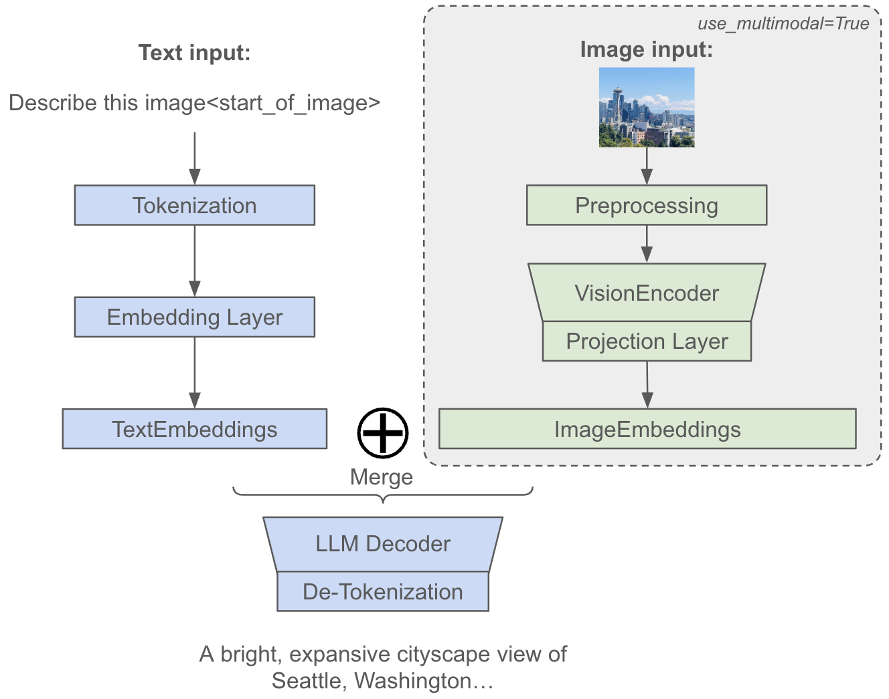

# Multimodal Support on MaxText

This document provides a guide to use the multimodal functionalities in MaxText including:
- **Checkpoint Conversion**: Convert a MaxText-compatible orbax checkpoint from HuggingFace.
- **Multimodal Decode**: Inference with text+images as input.
- **Supervised Fine-Tuning (SFT)**: Apply SFT to the model using a visual-question-answering dataset.

We also provide a [colab](https://github.com/AI-Hypercomputer/maxtext/blob/main/src/MaxText/examples/multimodal_gemma3_demo.ipynb) for multimodal features demonstration. The following table provides a list of models and modalities we currently support:
| Models | Input Modalities | Output Modalities |
| :---- | :---- | :---- |
| - Gemma3-4B/12B/27B<br>- Llama4-Scout/Maverick | Text, images | Text |

## Introduction

Multimodal Large Language Models (LLMs) extend traditional text-only models by incorporating multiple input modalities such as images, audio, and video. For each non-text modality, the architecture typically follows a three-stage pipeline: 
- **Data Preprocessing**: We apply modality-specific preprocessing steps to prepare the raw input data (e.g., image resizing and normalization), transforming them into a format which neural networks can understand.
- **Modality-Specific Encoders**: Modality-specific encoders will transform the preprocessed data into high-dimensional representations (e.g., vision transformers for images).
- **Projection and Merge**: Projection layers will map these modality-specific embeddings into the shared embedding space of the language model, usually aligned with the dimension of text embeddings. These projected embeddings are then merged with text token embeddings, allowing the unified model to process and reason over multiple modalities simultaneously within a single coherent framework.


*Figure 1: Overview of multimodal dataflow in MaxText.*


## Checkpoint Conversion

Recently we have onboarded a new centralized tool for bidirectional checkpoint conversion between MaxText and HuggingFace ([README](https://github.com/AI-Hypercomputer/maxtext/blob/main/src/MaxText/utils/ckpt_conversion/README.md)). This tool is used for the Gemma3 model family. Use this command to convert an unscanned checkpoint from HuggingFace to MaxText, and save it to `MAXTEXT_CKPT_GCS_PATH`:

```shell
export HF_ACCESS_TOKEN=hf_...
export MAXTEXT_CKPT_GCS_PATH=gs://...
python -m MaxText.utils.ckpt_conversion.to_maxtext MaxText/configs/base.yml \
    model_name=gemma3-4b \
    hf_access_token=$HF_ACCESS_TOKEN \
    base_output_directory=$MAXTEXT_CKPT_GCS_PATH \
    use_multimodal=true \
    scan_layers=false
```

For the Llama4 model family, we are using a separate checkpoint conversion script (of note, we will gradually migrate all checkpoint conversion scripts to the above consolidated tool soon):

```shell
export LOCAL_HF_MODEL_PATH=...  # Need to pre-download the safetensors from HuggingFace
export MAXTEXT_CKPT_GCS_PATH=gs://...
python -m MaxText.utils.ckpt_scripts.llama4_ckpt_unscanned \
    --model-size=llama4-17b-16e \
    --huggingface-checkpoint=True \
    --base-model-path=$LOCAL_HF_MODEL_PATH \
    --maxtext-model-path=$MAXTEXT_CKPT_GCS_PATH
```

## Multimodal Decode
MaxText supports multimodal decoding, allowing you to input text with multiple images to get a text output. To use this feature, you need three main settings:
- `use_multimodal=True`: Initializes the multimodal preprocessing steps and network components.
- `prompt`: Specifies the position of image placeholder tokens in your input. If you don't manually place them, MaxText will automatically append the required placeholder (e.g., `<start_of_image>` for Gemma3, `<|image|>` for Llama4). The exact placeholder is listed under the `image_placeholder` field in each model's configuration file.
- `image_path`: The path(s) to the image file(s) MaxText will load and process.

Since each model uses a unique native chatting template from its pretraining, we've implemented these specific templates within `multimodal_utils.py` and apply them directly to your prompt.

To run a forward pass and verify the model's output, use the following command:

```shell
# Gemma3 decode
python -m MaxText.decode \
    MaxText/configs/base.yml \
    model_name=gemma3-4b \
    hf_access_token=$HF_ACCESS_TOKEN \
    tokenizer_path=assets/tokenizer.gemma3 \
    load_parameters_path=$MAXTEXT_CKPT_GCS_PATH/0/items \
    per_device_batch_size=1 \
    run_name=ht_test \
    max_prefill_predict_length=272 \
    max_target_length=300 \
    steps=1 \
    async_checkpointing=false \
    scan_layers=false \
    use_multimodal=true \
    prompt='Describe image <start_of_image>' \
    image_path='MaxText/test_assets/test_image.jpg' \
    attention='dot_product'
```

The decoding results will look like this:
```
Input `<start_of_turn>user
Describe image <start_of_image><end_of_turn>
<start_of_turn>model
` -> `Here's a description of the image:

**Overall Impression:** The image is a bright, expansive cityscape view of Seattle, Washington, with`
```

To decode with multiple images at once, you can provide multiple image paths like this:

```
python -m MaxText.decode \
    MaxText/configs/base.yml \
    model_name=gemma3-4b \
    ... \
    image_path=/path/to/image1.jpg,/path/to/image2.jpg \
    prompt="Describe each image in a short sentence." # <start_of_image> will be added to prompt if not provided
    # or prompt="Describe each image in a short sentence: <start_of_image> and <start_of_image>"
```

For larger models such as Llama4-Scout/Maverick, we suggest to run the decoding on a TPU cluster such as v5p-16.

## Supervised Fine-Tuning

Supervised Fine-Tuning (SFT) of multimodal LLMs in MaxText focuses specifically on post-training; we don't yet support pre-training multimodal models from scratch. The SFT process typically involves training on Visual Question Answering (VQA) datasets where the model learns to generate accurate text responses based on both visual and textual inputs. During this fine-tuning phase, we recommend to freeze the pre-trained encoder layers (such as vision transformers) to preserve their learned visual representations, while the projection layers and LLM decoder components remain trainable. This selective training strategy allows the model to adapt the cross-modal alignment and text generation capabilities without disrupting the robust feature extraction abilities of the encoders, ultimately leading to improved performance on multimodal understanding and reasoning tasks while maintaining computational efficiency. This is achieved by setting `freeze_vision_encoder_params=True` in [sft-vision-chartqa.yml](https://github.com/AI-Hypercomputer/maxtext/blob/main/src/MaxText/configs/sft-vision-chartqa.yml).

Here, we use [ChartQA](https://huggingface.co/datasets/HuggingFaceM4/ChartQA) as an example to demonstrate SFT functionality:


```shell
python -m MaxText.sft_trainer \
    $MAXTEXT_REPO_ROOT/configs/sft-vision-chartqa.yml \
    run_name="chartqa-sft" \
    model_name=gemma3-4b \
    tokenizer_path="google/gemma-3-4b-it" \
    hf_access_token=$HF_ACCESS_TOKEN \
    load_parameters_path=$UNSCANNED_CKPT_PATH \
    base_output_directory=$BASE_OUTPUT_DIRECTORY \
    per_device_batch_size=1 \
    steps=$STEPS \
    max_prefill_predict_length=1024 \
    max_target_length=2048 \
    checkpoint_period=1000 \
    scan_layers=False \
    async_checkpointing=True \
    enable_checkpointing=True \
    attention=dot_product \
    max_num_images_per_example=1 \
    dataset_type=hf profiler=xplane
```

## Other Recommendations
- **Setting appropriate prefill length**: To prevent truncation and ensure your full input (text + image) is processed, the prefill length should be set longer than the total combined length of your text tokens and image tokens. This combined length makes up the final sequence fed to the decoder. We recommend to estimate the combined sequence length from your full input and then add a buffer when setting your `max_prefill_predict_length` for decoding. Token estimation rules:
    - For text tokens, a good estimate is:
        
        $\text{Text Tokens} \approx 1.3 \times \text{Number of Words in Prompt}$.
    - For Gemma3, each image is resized to 896*896 and contributes 256 tokens: 
        
        $\text{Total Tokens} \approx \text{Text Tokens} + \text{Number of Images} * 256$.
    - For Llama4 models, each image is dynamically tiled based on its size, with each resulting tile contributing 144 tokens:
        
        $\text{Total Tokens} \approx \text{Text Tokens} + 144 \times \sum_{i=1}^{N} \text{Number of Tiles of Image}_i$.

