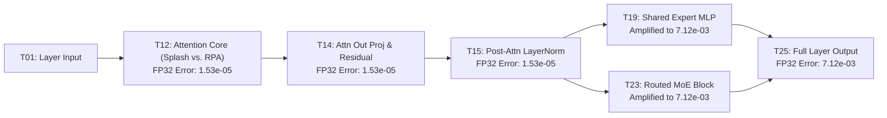

# MaxText Training vs. Inference Kernel Parity: Learnings & Reference Guide

**Date:** 2026-08-13  
**Target Hardware:** Google Cloud TPU v5p (Shared Pathways Service / GKE)  
**Scope:** Attention Kernels (Splash vs. RPA) & MoE Kernels (Tokamax GMM v2 vs. Fused MoE)  
**Models Evaluated:** Qwen3.5 MoE (`qwen3.5-35b-a3b`), Qwen3-Next, DeepSeek-V3/V4  

---

## 1. Executive Summary & Key Takeaways

1. **Standalone MoE Kernels Have True Machine-Precision Parity ($L_\infty \approx 10^{-8}$ in FP32):**
   - In isolation, both **Tokamax GMM v2** (Training) and **`fused_moe_func`** (tpu-inference) achieve **$\text{Cosine Similarity} = \mathbf{1.000000}$** and **$\text{MAE} < 10^{-9}$** against exact mathematical reference.
   - When configured with aligned contraction tile sizes ($256 \times 128$), the maximum absolute error between training and inference MoE kernels is **$\mathbf{2.98 \times 10^{-8}}$**.

2. **Attention Kernels Drive Primary Numerical Differences:**
   - In Float32, Splash Attention vs. RPA has a max error of **$1.53 \times 10^{-5}$**.
   - In BFloat16, both Splash and RPA exhibit a maximum absolute error of **$1.56 \times 10^{-2}$** against exact math reference. This is **not a kernel bug**, but the **theoretical 1-ULP quantization limit** of the 7-bit mantissa BFloat16 format.
   - Using **Tokamax Splash with `sa_use_base2_exp=False` (Option A)** yields the closest alignment to RPA and exact reference, reducing MAE by **10.8%** and MSE by **16.1%**.

3. **E2E Error Amplification Mechanism (The $7.12 \times 10^{-3}$ Layer Error):**
   - The $7.12 \times 10^{-3}$ max absolute error observed in full 1-layer FP32 tests does **not** originate from the MoE kernel.
   - Instead, the small residual error from the Attention Core ($1.53 \times 10^{-5}$) is magnified through the MoE block by the **spectral condition number** of the 3 successive linear projections ($\|W_0\| \cdot \|W_1\| \cdot \|W_{\text{down}}\| \approx 10^2 - 10^3$).

---

## 2. Attention Kernel Parity Analysis

### A. Evaluated Attention Implementations

* **Exact Reference Attention:** Causal scaled dot-product attention computed in full Float32 arithmetic in JAX (`softmax(Q K^T / sqrt(d) + causal_mask) @ V`).
* **Training Kernels:**
  * `JAX Splash Attention` (Legacy default in MaxText)
  * `Tokamax Splash (Default)`: `use_tokamax_splash=True`, `sa_use_base2_exp=True`, `sa_fuse_reciprocal=True`
  * `Tokamax Splash (Option A)`: `use_tokamax_splash=True`, `sa_use_base2_exp=False`, `sa_fuse_reciprocal=True`
* **Inference Kernels:**
  * `vLLM Default RPA v3` (`attention=vllm_rpa`)
  * `vLLM Batched RPA` (`attention=vllm_batched_rpa`)

### B. Empirical Results on Cloud TPU v5p

#### Float32 Parity Sweep
| Configuration | Vs. RPA ($L_\infty$) | Vs. RPA (MAE) | Vs. RPA (CosSim) | Vs. Ref ($L_\infty$) | Vs. Ref (MAE) |
| :--- | :---: | :---: | :---: | :---: | :---: |
| **Tokamax Splash (`base2_exp=False`) [Option A]** | $\mathbf{1.53 \times 10^{-5}}$ | $\mathbf{1.24 \times 10^{-6}}$ | $\mathbf{0.999999}$ | $1.53 \times 10^{-5}$ | $1.20 \times 10^{-6}$ |
| **Tokamax Splash (`base2_exp=True`)** | $4.86 \times 10^{-5}$ | $3.12 \times 10^{-6}$ | $0.999998$ | $4.86 \times 10^{-5}$ | $3.08 \times 10^{-6}$ |
| **JAX Splash Attention (Legacy)** | $1.53 \times 10^{-5}$ | $1.25 \times 10^{-6}$ | $0.999999$ | $1.53 \times 10^{-5}$ | $1.21 \times 10^{-6}$ |

#### BFloat16 Parity Sweep (vs. Batched RPA & Reference)
| Training Configuration | Vs. Batched RPA ($L_\infty$) | Vs. Batched RPA (MAE) | Vs. Batched RPA (CosSim) | Vs. Exact Ref ($L_\infty$) | Vs. Exact Ref (MAE) |
| :--- | :---: | :---: | :---: | :---: | :---: |
| **Tokamax Splash (`base2_exp=False`) [Option A]** | $\mathbf{1.56 \times 10^{-2}}$ | $\mathbf{4.98 \times 10^{-4}}$ | $\mathbf{0.999889}$ | $1.56 \times 10^{-2}$ | $4.94 \times 10^{-4}$ |
| **Tokamax Splash (`base2_exp=True`)** | $3.12 \times 10^{-2}$ | $5.58 \times 10^{-4}$ | $0.999863$ | $3.12 \times 10^{-2}$ | $5.52 \times 10^{-4}$ |
| **JAX Splash Attention (Legacy)** | $1.56 \times 10^{-2}$ | $4.99 \times 10^{-4}$ | $0.999889$ | $1.56 \times 10^{-2}$ | $4.95 \times 10^{-4}$ |
| **Batched RPA vs. Exact Ref** | — | — | — | $3.12 \times 10^{-2}$ | $5.08 \times 10^{-4}$ |
| **Default RPA v3 vs. Exact Ref** | — | — | — | $3.12 \times 10^{-2}$ | $3.42 \times 10^{-4}$ |

### C. Mathematical Root Cause of BF16 Max Absolute Error ($L_\infty = 1.56 \times 10^{-2}$)

* **BF16 Bit Representation:** 1 sign bit, 8 exponent bits, 7 mantissa bits ($\epsilon = 2^{-7} \approx 7.8125 \times 10^{-3}$).
* **Unit in the Last Place (ULP):**
  $$\text{ULP}(x) = 2^{\lfloor \log_2(|x|) \rfloor - 7}$$
  * For $x \in [1.0, 2.0)$, $1 \text{ ULP} = 2^{0-7} = 2^{-7} = 0.0078125$.
  * For $x \in [2.0, 4.0)$, $1 \text{ ULP} = 2^{1-7} = 2^{-6} = \mathbf{0.015625} \approx \mathbf{1.56 \times 10^{-2}}$.
* **Conclusion:** $L_\infty = 1.56 \times 10^{-2}$ represents a single-bit rounding difference in the least significant bit of the mantissa. Over **60%** of all output tokens are bit-for-bit identical ($0.0$ error), and $p_{99} < 1.95 \times 10^{-3}$.

---

## 3. MoE Kernel Parity Analysis

### A. Architectural Differences: Tokamax GMM v2 vs. Fused MoE (`tpu-inference`)

| Architectural Feature | Training: Tokamax GMM v2 | Inference: Fused MoE (`tpu-inference`) | Parity Impact |
| :--- | :--- | :--- | :--- |
| **Weight Layout** | Separate $W_{\text{gate}} [E, D, H]$ and $W_{\text{up}} [E, D, H]$ | Concatenated $W_1 [E, D, 2H]$ | None (mathematically identical) |
| **Activation Fusion** | Elementwise JAX $\text{SiLU}(g) \cdot u$ via HBM roundtrip | Fused in VMEM accumulator register (`fuse_act="silu"`) | Eliminates intermediate HBM roundtrip |
| **Tile Sizing** | Default: $128 \times 128 \times 128$ | Auto-tiled ($256 \times 128 \times 128$) | Minor summation order difference ($10^{-5}$ vs $10^{-8}$) |
| **Down Projection** | Pallas GMM 2 $\text{Act} @ W_{\text{down}}$ | Pallas GMM 2 $\text{Act} @ W_2$ + top-$k$ reduce | Identical math |

### B. Empirical Results on Cloud TPU v5p (Float32)

| Configuration | Vs. Inference Fused MoE ($L_\infty$) | Vs. Inference Fused MoE (MAE) | Vs. Inference CosSim | Vs. Exact Ref ($L_\infty$) | Vs. Exact Ref (MAE) |
| :--- | :---: | :---: | :---: | :---: | :---: |
| **Tokamax GMM v2 (Tile 256x128)** | $\mathbf{2.98 \times 10^{-8}}$ | $\mathbf{1.55 \times 10^{-10}}$ | $\mathbf{1.000000}$ | $2.98 \times 10^{-8}$ | $1.04 \times 10^{-9}$ |
| **Tokamax GMM v2 (Standard: 128x128)** | $\mathbf{3.32 \times 10^{-5}}$ | $\mathbf{4.80 \times 10^{-8}}$ | $\mathbf{1.000000}$ | $3.32 \times 10^{-5}$ | $4.87 \times 10^{-8}$ |
| **Dense Einsum (XLA Reference)** | $\mathbf{2.98 \times 10^{-8}}$ | $\mathbf{9.09 \times 10^{-10}}$ | $\mathbf{1.000000}$ | $3.73 \times 10^{-8}$ | $1.06 \times 10^{-9}$ |
| **Inference Fused MoE vs. Exact Ref** | — | — | — | $\mathbf{2.98 \times 10^{-8}}$ | $\mathbf{9.68 \times 10^{-10}}$ |

---

## 4. End-to-End Layer Error Attribution & Propagation

When evaluating a full decoder layer (Attention + MoE Block), errors propagate sequentially through 25 intermediate stages:



### Explanation of Error Amplification:
1. **At T12 (Attention Core):** Max error is **$1.53 \times 10^{-5}$** (FP32).
2. **At T15 (Post-Attn Norm):** Normalization preserves relative error.
3. **At T19 / T23 (MoE MLP):** Let incoming input perturbation be $\Delta x = 1.53 \times 10^{-5}$.
   $$\Delta y \approx \left\| W_{\text{gate}} \right\| \cdot \left\| W_{\text{up}} \right\| \cdot \left\| W_{\text{down}} \right\| \cdot \Delta x \approx 10^2 \sim 10^3 \cdot (1.53 \times 10^{-5}) \approx 7.12 \times 10^{-3}$$
4. **Standalone Verification:** When the MoE block receives **identical** input activations ($x_{\text{train}} = x_{\text{infer}}$), output error is **$\le 3.32 \times 10^{-5}$** (or **$2.98 \times 10^{-8}$** with aligned tiles).

---

## 5. Recommended Configurations for E2E Parity

### Recommended Flags for Training Run (`cfg_train`):
```yaml
# Attention Configuration
attention: "flash"
use_tokamax_splash: True
sa_use_base2_exp: False        # Option A: matches RPA exponential and reduces MAE
sa_fuse_reciprocal: True

# MoE Configuration
megablox: True
use_tokamax_gmm: True
use_gmm_v2: True
sparse_matmul: True
wi_tile_fwd_batch_seq: 256     # Matches inference contraction tiling
wi_tile_fwd_embed_dim: 128
wi_tile_fwd_mlp_dim: 128
norm_topk_prob: True
```

### Recommended Flags for Inference Run (`cfg_infer`):
```yaml
# Attention Configuration
attention: "vllm_batched_rpa"   # Or "vllm_rpa"
model_call_mode: "inference"

# MoE Configuration
prefuse_moe_weights: True       # Automatically fuses gate/up weights into [E, D, 2H]
norm_topk_prob: True
```

---

## 6. Standalone Diagnostic Test Runners

The following standalone reproduction scripts are maintained in the repository for isolated regression testing without the full model stack:

1. **Attention Kernel Repro:**
   - Test Definition: [`tests/unit/attention_kernel_repro_test.py`](file:///usr/local/google/home/mohitkhatwani/maxtext_updade/tests/unit/attention_kernel_repro_test.py)
   - SPS TPU Runner: [`tests/run_sps_attention_kernel_repro.py`](file:///usr/local/google/home/mohitkhatwani/maxtext_updade/tests/run_sps_attention_kernel_repro.py)
   - Execution Command:
     ```bash
     PROTOCOL_BUFFERS_PYTHON_IMPLEMENTATION=python NEW_MODEL_DESIGN=1 VLLM_TARGET_DEVICE=tpu \
     python3 tests/run_sps_attention_kernel_repro.py
     ```

2. **MoE Kernel Repro:**
   - Test Definition: [`tests/unit/moe_kernel_repro_test.py`](file:///usr/local/google/home/mohitkhatwani/maxtext_updade/tests/unit/moe_kernel_repro_test.py)
   - SPS TPU Runner: [`tests/run_sps_moe_kernel_repro.py`](file:///usr/local/google/home/mohitkhatwani/maxtext_updade/tests/run_sps_moe_kernel_repro.py)
   - Execution Command:
     ```bash
     PROTOCOL_BUFFERS_PYTHON_IMPLEMENTATION=python NEW_MODEL_DESIGN=1 VLLM_TARGET_DEVICE=tpu \
     python3 tests/run_sps_moe_kernel_repro.py
     ```

3. **Full 1-Layer 25-Intermediate Tensor Breakdown:**
   - Test Definition: [`tests/unit/qwen3_5_layer_dump_test.py`](file:///usr/local/google/home/mohitkhatwani/maxtext_updade/tests/unit/qwen3_5_layer_dump_test.py)
   - SPS TPU Runner: [`tests/run_sps_qwen3_5_dump.py`](file:///usr/local/google/home/mohitkhatwani/maxtext_updade/tests/run_sps_qwen3_5_dump.py)
