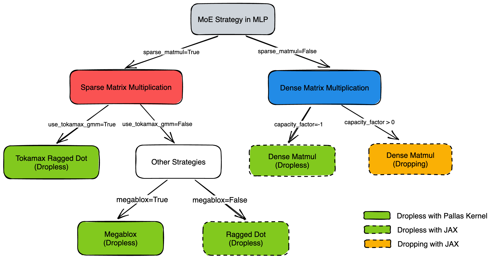

<!--
 Copyright 2025 Google LLC

 Licensed under the Apache License, Version 2.0 (the "License");
 you may not use this file except in compliance with the License.
 You may obtain a copy of the License at

      https://www.apache.org/licenses/LICENSE-2.0

 Unless required by applicable law or agreed to in writing, software
 distributed under the License is distributed on an "AS IS" BASIS,
 WITHOUT WARRANTIES OR CONDITIONS OF ANY KIND, either express or implied.
 See the License for the specific language governing permissions and
 limitations under the License.
 -->

# Mixture of Experts (MoE) Configuration

This document provides a detailed explanation of the configuration parameters related to Mixture of Experts (MoE) models in MaxText. These settings control the model architecture, routing mechanisms, and performance optimizations. Default values and parameter definitions are located in `src/MaxText/configs/base.yml` and are primarily used in `src/MaxText/layers/moe.py`.

## 1. Architecture

### MoE Strategy
MaxText supports both Dropless and Dropping strategies. Please refer to the decision tree below to determine the active strategy.

*Figure 1: Decision Logic for MaxText MoE Strategies.*

Dropless:
* [Tokamax Ragged Dot](https://github.com/openxla/tokamax/tree/main/tokamax/_src/ops/ragged_dot): Enabled by setting `sparse_matmul=True, use_tokamax_gmm=True`. 
* [Megablox](https://github.com/google/maxtext/tree/main/src/MaxText/kernels/megablox): Enabled by setting `sparse_matmul=True, use_tokamax_gmm=False, megablox=True`. 
* [JAX Ragged Dot](https://docs.jax.dev/en/latest/_autosummary/jax.lax.ragged_dot.html): Enabled by setting `sparse_matmul=True, use_tokamax_gmm=False, megablox=False`. 
* Dense Matmul: Enabled by setting `sparse_matmul=False, capacity_factor=-1`. 

Dropping:
* Dense Matmul: Enabled by setting `sparse_matmul=False, capacity_factor > 0` (commonly 1.0 to 1.25).

### General Configuration
`num_experts`: The total number of routed experts available in the MoE layer.

`num_experts_per_tok`: The number of experts selected for each token, often referred to as top-k strategy.

`shared_experts`: The number of experts that are always active for every token, in addition to the routed experts.

`base_moe_mlp_dim`: The intermediate dimension size for the MLP blocks within the experts.

`interleave_moe_layer_step`: Defines the frequency of MoE layers in transformers. If set to 1, every layer is an MoE layer. If set to X, an MoE layer appears every X layers.

`first_num_dense_layers`: The number of initial dense layers before the first MoE layer is introduced.

`float32_weight_sum`: If enabled, performs the summation of expert weights using float32 precision for improved numerical stability.

### Routing Mechanism
`use_random_routing`: If enabled, ignores the gate logits and routes tokens to random experts. This is designed to simulate load balancing for debugging and performance testing purposes.

`n_routing_groups` and `topk_routing_group`: Experts are divided into n_routing_groups. The router first selects the top k highest-scoring groups (as `topk_routing_group`), and then selects experts only from those groups.

`routed_bias`: If enabled, adds a learnable bias term to the gate logits to facilitate load balancing.

`routed_score_func`: Defines the scoring function for the router.

`routed_scaling_factor`: A scalar multiplier applied to the expert weights.

`load_balance_loss_weight`: Sets the coefficient for the auxiliary loss term used to encourage balanced token distribution among experts.

`norm_topk_prob`: If enabled, normalizes the router weights for the selected top-k experts.

### MLP Block & Computation
`sparse_matmul`: Determines whether to use efficient sparse matrix multiplication or dense matrix multiplication.
  * `True`: Uses specialized kernels (like Tokamax Ragged Dot or Megablox) or JAX Ragged Dot to perform computation only on active tokens. This is generally faster for MoE.
  * `False`: Performs dense computation with masking. This is typically used when checking numerical correctness or implementing dropping strategies.

`use_tokamax_gmm`: If enabled, use Tokamax library's Ragged Dot for matmul. Recommended for dropless configurations.

`megablox`: If enabled, use Megablox for sparse matrix operations. Effective only when `use_tokamax_gmm` is False.

`capacity_factor`: A scalar multiplier for expert capacity. Effective only when `sparse_matmul` is False.
  * Value > 0: Enforces a strict capacity limit; tokens exceeding this limit are dropped.
  * Value = -1: Dropless with dense matrix multiplication, which is computationally expensive and typically used only as a baseline.

`use_custom_sort_vjp`: If enabled, use a custom Vector-Jacobian Product (VJP) sort for efficient backward pass processing in sparse matmul.

`mlp_bias`: If enabled, add bias terms within the expert MLP layers.

`use_batch_split_schedule` (experimental): If enabled, split batch into micro-batches to hide communications.

## 2. Sharding
`expert_shard_attention_option`: Determines how the "expert" axis is interpreted when sharding attention layers. Options include:
  * `fsdp`: Treats the expert axis as a FSDP axis.
  * `context`: Treats the expert axis as a context parallelism axis, useful for long context.

`use_ring_of_experts` (experimental): This feature requires expert parallelism. If enabled, it replaces the standard two All-to-All communications with All-Gather in dispatch and Reduce-Scatter in collect. By gathering inputs across all shards, it allows for local routing and Top-K calculations, followed by result aggregation via Reduce-Scatter. This approach is particularly effective for models with a large Top-K, as it gathers activations before they are replicated k times to reduce communication.

`moe_fsdp_use_two_stage_all_gather`: If enabled, splits the All-Gather operation for MoE weights into two separate stages when using FSDP/FSDP-transpose sharding. This is preferred when 3D All-Gather support is unavailable.

`fsdp_shard_on_exp`: If enabled, shard MLP weights on expert dimension instead of embedding dimension during FSDP sharding.

## 3. Performance Tuning
These parameters provide granular control over the tiling dimensions for sparse matmul Pallas kernel.

* `wi_tile_...`: Tile size for the first layer of the MLP (Input -> Hidden).
* `wo_tile_...`: Tile size for the second layer of the MLP (Hidden -> Output).

For each, you can control:
* `..._fwd_...`: Tile size for the forward pass.
* `..._dlhs_...`: Tile size for the backward pass gradient calculation w.r.t. activations.
* `..._drhs_...`: Tile size for the backward pass gradient calculation w.r.t. weights.

For each dimension, you can control:
* `..._batch_seq`: Tile size for batch x sequence dimension.
* `..._embed_dim`: Tile size for embedding dimension.
* `..._mlp_dim`: Tile size for MLP dimension.

Implementation Support:
* Megablox/JAX Ragged Dot: 
  * Supports forward pass only (6 configs: `wi_tile_fwd...` and `wo_tile_fwd_...`).
  * Configs are enabled for INT8, FP8, and BF16.

* Tokamax Ragged Dot:
  * Supports all 18 configurations. **Note**: Currently enabled for FP8 quantization; BF16 integration is in progress.
