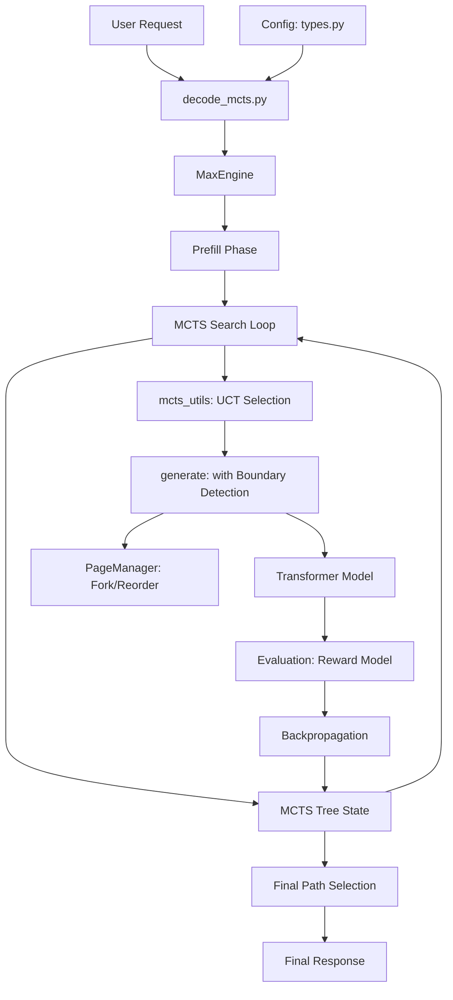

<!--
# Copyright 2023–2026 Google LLC
#
# Licensed under the Apache License, Version 2.0 (the "License");
# you may not use this file except in compliance with the License.
# You may obtain a copy of the License at
#
#    https://www.apache.org/licenses/LICENSE-2.0
#
# Unless required by applicable law or agreed to in writing, software
# distributed under the License is distributed on an "AS IS" BASIS,
# WITHOUT WARRANTIES OR CONDITIONS OF ANY KIND, either express or implied.
# See the License for the specific language governing permissions and
# limitations under the License.
-->

# Design Document: JAX-MCTS (Tree of Thoughts) for MaxText

> [!IMPORTANT]
> **WORK IN PROGRESS**: This document describes a proposed inference strategy. The implementation is currently under active development and is not yet available in the MaxText main branch.

This document outlines the high-level design for implementing a Monte Carlo Tree Search (MCTS) decoding strategy in MaxText, inspired by the paper *"Tree of Thoughts: Deliberate Problem Solving with Large Language Models"* (Yao et al., 2023).

---

## 1. Overview
The goal is to enable "Deliberate Reasoning" by allowing the model to explore multiple branching paths of "thoughts." Unlike standard greedy or beam search, JAX-MCTS uses a principled search algorithm to evaluate the potential of different reasoning steps and prioritize exploration of promising paths.

---

## 2. Use Cases
JAX-MCTS is specifically designed for high-regret tasks where the "path to the solution" is non-linear and requires systematic exploration. Key applications include:

*   **Mathematical Theorem Proving**: Navigating multi-step logical derivations where a single reasoning error can invalidate the entire solution path.
*   **Scientific Hypothesis Generation**: Exploring branching deductive paths for complex experimental design or data interpretation.
*   **Algorithmic Code Synthesis**: Solving competitive programming challenges that require planning, modularity, and the ability to backtrack from logical dead-ends.
*   **Strategic Planning & Logistics**: Multi-step decision making where the value of a current choice can only be estimated by its potential future outcomes.
*   **Structured Content Planning**: Designing long-form documents or narratives by first searching for the most coherent structural outline.

---

## 3. System Architecture

---

## 3. Core Components

### 3.1 `decode_mcts.py` (Entry Point)
A new inference script that initializes the `MaxEngine` and replaces the standard greedy loop with the `MCTSTreeSearch` loop. It handles search configuration parameters like `mcts_simulations` and `thought_limit`.

### 3.2 Modified `MaxEngine`
The engine is updated to handle the **MCTS Search Loop**. It manages the `DecodeState` and coordinates the transition between different tree branches.
*   **Modified `generate()`**: Now includes **Boundary Detection** to stop at "End of Thought" (EOT) signals like `\n`.

### 3.3 `mcts_utils.py` (Functional Logic)
Contains the core mathematical logic for the search:
*   **UCT Selection**: Calculates Upper Confidence Bound scores to balance exploration/exploitation.
*   **Backpropagation**: Updates the running average of values and visit counts for all nodes on a path.

### 3.4 Paged Attention & `PageManager`
Critical for **Prefix Sharing**. When the search "jumps" to a child or sister branch, the `PageManager` performs an O(1) "memory restore" by updating the `page_map` to point to the shared history, avoiding redundant computation.

---

## 4. The MCTS Cycle

1.  **Selection**: Starting from the root node, the algorithm uses the **UCT (Upper Confidence Bound applied to Trees) Formula** to select the most "interesting" path until a leaf node is reached.

    $$UCT(n) = \underbrace{\frac{W(n)}{N(n)}}_{\text{Exploitation}} + \underbrace{C \sqrt{\frac{\ln N(parent)}{N(n)}}}_{\text{Exploration}}$$

    *   **The Exploitation Term ($\frac{W}{N}$)**: This is the average value or "reputation" of the node. It drives the search toward paths that have historically yielded high reasoning scores.
    *   **The Exploration Term ($\sqrt{\dots}$)**: This term grows as the parent is visited but the specific child is ignored. It forces the algorithm to "check its blind spots" and explore less-visited nodes to ensure a better solution isn't hidden elsewhere.
    *   **$W(n)$**: Total accumulated evaluation score for node $n$.
    *   **$N(n)$**: Visit count for node $n$.
    *   **$N(parent)$**: Total visits to the parent node.
    *   **$C$**: The exploration constant (tuning parameter). A higher $C$ makes the model more "curious" and diverse.
2.  **Expansion**: The selected leaf node is expanded. The model generates tokens until it hits a **Thought Boundary** (e.g., a newline). This creates one or more new child nodes.
3.  **Evaluation**: Instead of a "Random Rollout" in a traditional MCTS, a **Reward Model** or **Self-Evaluation prompt** is used to assign a score to the new thought. This score acts as the "Estimated Future Value."
4.  **Backpropagation**: The evaluation score and the visit count (+1) are propagated from the leaf back up to the root, updating the **running average** reputation of every node on that path.

---

## 5. Key Implementation Details

### Thought Boundaries
Thoughts are logically encapsulated "steps" in reasoning.
*   **Primary Boundary**: Newline character (`\n`).
*   **Fallback**: Maximum token length per thought (e.g., 64 tokens) or terminal `<|EOS|>` token.

### 5.1 Prompting for Thought Boundaries
For the `generate()` loop to accurately detect the end of a thought, the model must be instructed to use a consistent delimiter.
*   **System Prompt Requirement**: The model should be prompted with instructions such as: *"Break your reasoning into clear steps. End each reasoning step with a single newline (\n)."* or *"Use 'Thought:' to begin a step and a double newline to end it."*
*   **Stopping Logic**: The `MaxEngine.generate` loop uses a `stop_on_tokens` callback that monitors for these specific token IDs (e.g., `[13]` for newline) to trigger the evaluation phase.

### 5.2 KV Cache Management
To handle the branching nature of the tree, the system "checkpoints" the `PageState` at every node. When a node is selected for expansion, its parent's `page_map` is forked, allowing the new generation to resume exactly where the parent thought ended.

### Termination & Decision
1.  **Search Budget**: The loop continues for a fixed number of simulations or until a time timeout is hit.
2.  **Final Path (Greedy Fallback)**: After the search budget is exhausted:
    *   The algorithm identifies the **Most Visited Path** from the root by selecting children with the highest $N$. 
    *   Once the "best" leaf node (completed thought) is reached, the system transitions from MCTS-guided search to standard **Greedy Sampling** to complete the rest of the generation until a terminal `<|EOS|>` is reached. This ensures the reasoning is guided by search, while the structural completion is handled efficiently by the base engine.
