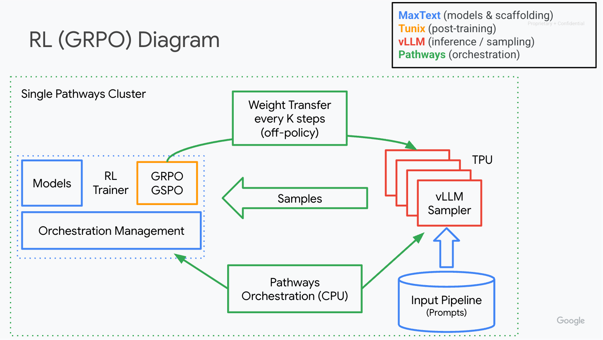
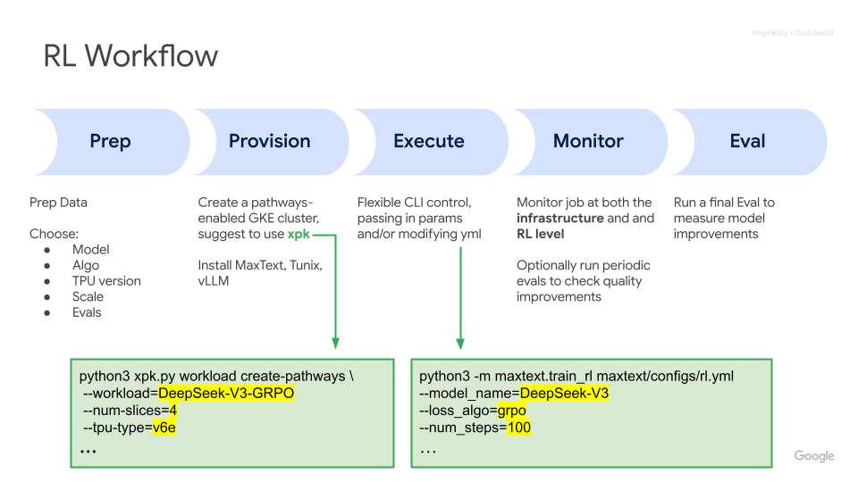

# Post training

## What is MaxText post training?

MaxText provides performance and scalable LLM and VLM post-training, across a variety of techniques like SFT and GRPO.

We’re investing in performance, scale, algorithms, models, reliability, and ease of use to provide the most competitive OSS solution available.

## The MaxText stack

MaxText was co-designed with key Google led innovations to provide a unified post training experience:
- [MaxText model library](https://maxtext.readthedocs.io/en/latest/index.html#model-library) for JAX LLMs highly optimized for TPUs
- [Tunix](https://github.com/google/tunix) for the latest algorithms and post-training techniques
- [vLLM on TPU](https://github.com/vllm-project/tpu-inference) for high performance sampling (inference) for Reinforcement Learning (RL)
- [Pathways](https://docs.cloud.google.com/ai-hypercomputer/docs/workloads/pathways-on-cloud/pathways-intro) for multi-host inference (sampling) and highly efficient weight transfer



## Supported techniques & models

- **SFT (Supervised Fine-Tuning)**
  * [SFT on Single-Host TPUs](https://maxtext.readthedocs.io/en/latest/tutorials/sft.html)
  * [SFT on Multi-Host TPUs](https://maxtext.readthedocs.io/en/latest/tutorials/sft_on_multi_host.html)
- **Multimodal SFT**
  * [Multimodal Support](https://maxtext.readthedocs.io/en/latest/guides/multimodal.html)
- **Reinforcement Learning (RL)**
  * [RL on Single-Host TPUs](https://maxtext.readthedocs.io/en/latest/tutorials/rl.html)
  * [RL on Multi-Host TPUs](https://maxtext.readthedocs.io/en/latest/tutorials/rl_on_multi_host.html)

## Step by step RL

Making powerful RL accessible is at the core of the MaxText mission

Here is an example of the steps you might go through to run a Reinforcement Learning (RL) job:



## What is Pathways and why is it key for RL?

Pathways is a single controller JAX runtime that was [designed and pressure tested internally at Google DeepMind](https://blog.google/technology/ai/introducing-pathways-next-generation-ai-architecture/) over many years. Now available on Google Cloud, it is designed to coordinate distributed computations across thousands of accelerators from a single Python program. It efficiently performs data transfers between accelerators both within a slice using ICI (Inter-chip Interconnect) and across slices over DCN (Data Center Network).

Pathways allows for fine grained resource allocation (subslice of a physical slice) and scheduling. This allows JAX developers to explore novel model architectures in an easy to develop single controller programming environment.

Pathways supercharges RL with:
1. **Multi-host Model Support:** Easily manages models that span multiple hosts.
1. **Unified Orchestration:** Controls both trainers and samplers from a single Python process.
1. **Efficient Data Transfer:** Optimally moves data between training and inference devices, utilizing ICI or DCN as needed. JAX Reshard primitives simplify integration.
1. **Flexible Resource Allocation:** Enables dedicating different numbers of accelerators to inference and training within the same job, adapting to workload bottlenecks (disaggregated setup).

## Getting started

Start your Post-Training journey through quick experimentation with our [Google Colabs](https://maxtext.readthedocs.io/en/latest/tutorials/how_to_run_colabs.html) or our Production level tutorials for [SFT](https://maxtext.readthedocs.io/en/latest/tutorials/sft_on_multi_host.html) and [GRPO](https://maxtext.readthedocs.io/en/latest/tutorials/grpo_with_pathways.html).

## More tutorials

```{toctree}
:maxdepth: 1

posttraining/how_to_run_colabs.md
posttraining/sft.md
posttraining/sft_on_multi_host.md
posttraining/rl.md
posttraining/rl_on_multi_host.md
posttraining/knowledge_distillation.md
posttraining/multimodal.md
posttraining/full_finetuning.md
```
