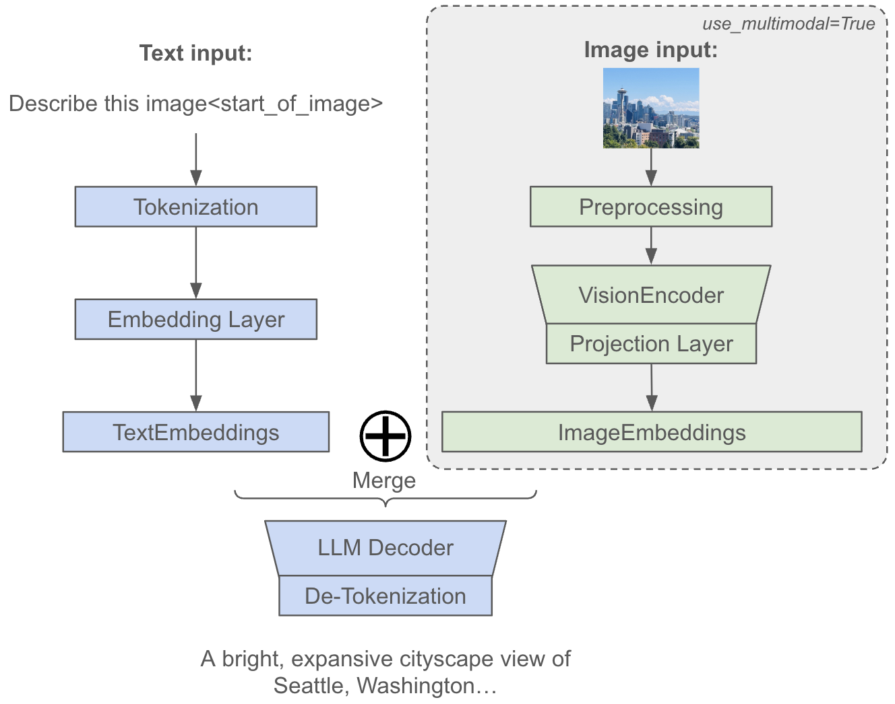

# Multimodal support

This document provides a guide to use the multimodal functionalities in MaxText including:

- **Checkpoint Conversion**: Convert a MaxText-compatible orbax checkpoint from HuggingFace.
- **Multimodal Decode**: Inference with text+images as input.
- **Supervised Fine-Tuning (SFT)**: Apply SFT to the model using a visual-question-answering dataset.

We also provide a [colab](https://github.com/AI-Hypercomputer/maxtext/blob/main/src/maxtext/examples/sft_multimodal_gemma3_demo.ipynb) for multimodal features demonstration. The following table provides a list of models and modalities we currently support:

| Models                      | Input: Text | Input: Image | Input: Video | Input: Audio | Output |
| :-------------------------- | :---------: | :----------: | :----------: | :----------: | :----: |
| **Gemma3** (4B/12B/27B)     |      ✓      |      ✓       |              |              |  Text  |
| **Gemma4** (26B/31B)        |      ✓      |      ✓       |              |              |  Text  |
| **Llama4** (Scout/Maverick) |      ✓      |      ✓       |              |              |  Text  |
| **Qwen3-Omni**              |      ✓      |      ✓       |      ✓       |      ✓       |  Text  |
| **Qwen3.5** (35B/397B)      |      ✓      |      ✓       |      ✓       |              |  Text  |

## Introduction

Multimodal Large Language Models (LLMs) extend traditional text-only models by incorporating multiple input modalities such as images, audio, and video. For each non-text modality, the architecture typically follows a three-stage pipeline:

- **Data Preprocessing**: We apply modality-specific preprocessing steps to prepare the raw input data (e.g., image resizing and normalization), transforming them into a format which neural networks can understand.
- **Modality-Specific Encoders**: Modality-specific encoders will transform the preprocessed data into high-dimensional representations (e.g., vision transformers for images).
- **Projection and Merge**: Projection layers will map these modality-specific embeddings into the shared embedding space of the language model, usually aligned with the dimension of text embeddings. These projected embeddings are then merged with text token embeddings, allowing the unified model to process and reason over multiple modalities simultaneously within a single coherent framework.


*Figure 1: Overview of multimodal dataflow in MaxText.*

## Install MaxText

For instructions on installing MaxText on your VM, please refer to the [official documentation](../../install_maxtext.md#from-source) and use the `maxtext[tpu]` installation path to include all necessary dependencies.

> **Note:** If you have previously installed MaxText with a different option, we strongly recommend using a fresh virtual environment for `maxtext[tpu]` to avoid potential library version conflicts.

## Setup environment variables

Login to Hugging Face. Provide your access token when prompted:

```bash
hf auth login
```

Set up the following environment variables to configure your training run. Replace
placeholders with your actual values.

```bash
# -- Model configuration --
# The MaxText model name. See `src/maxtext/configs/types.py` for `ModelName` for a
# full list of supported models.
export MODEL=<MODEL_NAME> # e.g., 'gemma3-4b'

# -- MaxText configuration --
# Use a GCS bucket you own to store logs and checkpoints. Ideally in the same
# region as your TPUs to minimize latency and costs.
# You can list your buckets and their locations in the
# [Cloud Console](https://console.cloud.google.com/storage/browser).
export BASE_OUTPUT_DIRECTORY=<GCS_BUCKET> # e.g., gs://my-bucket/maxtext-runs

# An arbitrary string to identify this specific run.
# We recommend to include the model, user, and timestamp.
export RUN_NAME=<RUN_NAME>

export STEPS=<STEPS> # e.g., 1000
```

## Checkpoint Conversion

This section explains how to prepare your model checkpoint for use with MaxText.

### Option 1: Using an existing MaxText checkpoint

If you already have a MaxText-compatible model checkpoint, simply set the following environment variable and move on to the next section.

```sh
export MAXTEXT_CKPT_PATH=<CKPT_PATH> # e.g., gs://my-bucket/my-model-checkpoint/0/items
```

### Option 2: Converting a Hugging Face checkpoint

Refer to [Hugging Face to MaxText](hf-to-maxtext) to convert a hugging face checkpoint to MaxText. Make sure you have correct checkpoint files converted and saved. Use this command to convert an unscanned checkpoint from HuggingFace to MaxText:

```sh
python3 -m pip install torch --index-url https://download.pytorch.org/whl/cpu

# We explicitly set lazy_load_tensors to False here as lazy loading of tensors
# is not supported when use_multimodal is True.
python3 -m maxtext.checkpoint_conversion.to_maxtext \
    model_name=${MODEL?} \
    base_output_directory=${BASE_OUTPUT_DIRECTORY?} \
    use_multimodal=true \
    scan_layers=false \
    --lazy_load_tensors=False \
    --eager_load_method="transformers"
```

After conversion finishes, set `MAXTEXT_CKPT_PATH` to the converted MaxText checkpoint path.

```sh
export MAXTEXT_CKPT_PATH=<CKPT_PATH> # e.g., gs://my-bucket/my-model-checkpoint/0/items
```

> [!IMPORTANT]
> **Matching the `scan_layers` Parameter:**
> The `scan_layers` setting during your fine-tuning run **must match** the setting used when creating the checkpoint at `MAXTEXT_CKPT_PATH`.
>
> - If the checkpoint was converted or saved with `scan_layers=False` (which is common for Hugging Face conversions and inference-ready models), you **must also provide `scan_layers=False` in the MaxText command.**

## Multimodal Decode

MaxText supports multimodal decoding, allowing you to input text with multiple images to get a text output. To use this feature, you need three main settings:

- `use_multimodal=True`: Initializes the multimodal preprocessing steps and network components.
- `prompt`: Specifies the position of image placeholder tokens in your input. If you don't manually place them, MaxText will automatically append the required placeholder (e.g., `<start_of_image>` for Gemma3, `<|image|>` for Llama4). The exact placeholder is listed under the `image_placeholder` field in each model's configuration file.
- `image_path`: The path(s) to the image file(s) MaxText will load and process.

Since each model uses a unique native chatting template from its pretraining, we've implemented these specific templates within `multimodal_utils.py` and apply them directly to your prompt.

### Decode with Text + Image

To run a forward pass and verify the model's output, use the following command:

```sh
python3 -m maxtext.inference.decode \
    model_name=${MODEL?} \
    tokenizer_path=src/maxtext/assets/tokenizers/tokenizer.gemma3 \
    load_parameters_path=${MAXTEXT_CKPT_PATH?} \
    per_device_batch_size=1 \
    max_prefill_predict_length=272 \
    max_target_length=300 \
    scan_layers=false \
    use_multimodal=true \
    prompt='Describe image <start_of_image>' \
    image_path='tests/assets/test_image.jpg' \
    attention='dot_product'
```

The decoding results will look like this:

```
Input `<start_of_turn>user
Describe image <start_of_image><end_of_turn>
<start_of_turn>model
` -> `Here's a description of the image:

**Overall Impression:** The image is a bright, expansive cityscape view of Seattle, Washington,`
```

To decode with multiple images at once, you can provide multiple image paths like this:

```
export TARGET_LENGTH=...  # Adjust to fit expected output length
export PREDICT_LENGTH=...  # Adjust to fit image tokens + text prompt

python3 -m maxtext.inference.decode \
    model_name=${MODEL?} \
    ... \
    max_prefill_predict_length=${PREDICT_LENGTH?}  # Adjust to fit image tokens + text prompt \
    max_target_length=${TARGET_LENGTH?} \
    image_path=/path/to/image1.jpg,/path/to/image2.jpg \
    prompt="Describe each image in a short sentence." # <start_of_image> will be added to prompt if not provided
    # or prompt="Describe each image in a short sentence: <start_of_image> and <start_of_image>"
```

For larger models such as Llama4-Scout/Maverick, we suggest to run the decoding on a TPU cluster such as v5p-16.

### Decode with Text + Video + Audio

For models that support video input (e.g., Qwen3-Omni and Qwen3.5), pass a video file via `video_path`. For Qwen3-Omni, which also supports audio, set `use_audio_in_video=true` to additionally process the embedded audio track. Since the required token budget scales with video length and resolution, set `max_prefill_predict_length` accordingly.

```sh
# Qwen3-Omni decode with video + audio
export MAXTEXT_CKPT_PATH=<Checkpoint GCS path>  # gs://my-bucket/path/0/items for Qwen3-Omni
python3 -m maxtext.inference.decode \
    model_name=qwen3-omni-30b-a3b \
    tokenizer_path=Qwen/Qwen3-Omni-30B-A3B-Instruct \
    tokenizer_type=huggingface \
    load_parameters_path=${MAXTEXT_CKPT_PATH?} \
    per_device_batch_size=1 \
    scan_layers=false \
    use_multimodal=true \
    use_audio_in_video=true \
    prompt='What can you see and hear? Answer in one short sentence.' \
    video_path='tests/assets/test_video.mp4' \
    max_prefill_predict_length=1250 \
    max_target_length=1280 \
    add_bos=false \
    attention='dot_product' \
```

The expected output will look similar to:

```
Input `<|im_start|>user
<|vision_start|><|video_pad|><|vision_end|>What can you see and hear? Answer in one short sentence.<|im_end|>
<|im_start|>assistant
` -> `A roaring Tyrannosaurus rex animatronic is displayed in a museum exhibit.
```

## Supervised Fine-Tuning

Supervised Fine-Tuning (SFT) of multimodal LLMs in MaxText focuses specifically on post-training; we don't yet support pre-training multimodal models from scratch. The SFT process typically involves training on Visual Question Answering (VQA) datasets where the model learns to generate accurate text responses based on both visual and textual inputs. During this fine-tuning phase, we recommend to freeze the pre-trained encoder layers (such as vision transformers) to preserve their learned visual representations, while the projection layers and LLM decoder components remain trainable. This selective training strategy allows the model to adapt the cross-modal alignment and text generation capabilities without disrupting the robust feature extraction abilities of the encoders, ultimately leading to improved performance on multimodal understanding and reasoning tasks while maintaining computational efficiency. This is achieved by setting `freeze_vision_encoder_params=True` in [sft-vision-chartqa.yml](https://github.com/AI-Hypercomputer/maxtext/blob/main/src/maxtext/configs/post_train/sft-vision-chartqa.yml).

**Text+image SFT is supported for all models listed above.** The following example uses Gemma3-4B with the [ChartQA](https://huggingface.co/datasets/HuggingFaceM4/ChartQA) dataset:

```shell
python3 -m maxtext.trainers.post_train.sft.train_sft_native \
    src/maxtext/configs/post_train/sft-vision-chartqa.yml \
    run_name=${RUN_NAME?} \
    model_name=${MODEL?} \
    load_parameters_path=${MAXTEXT_CKPT_PATH?} \
    base_output_directory=${BASE_OUTPUT_DIRECTORY?} \
    per_device_batch_size=1 \
    steps=${STEPS?} \
    max_prefill_predict_length=1024 \
    max_target_length=2048 \
    checkpoint_period=1000 \
    scan_layers=False \
    async_checkpointing=True \
    enable_checkpointing=True \
    attention=dot_product \
    max_num_images_per_example=1 \
    dataset_type=hf profiler=xplane
```

## Other Recommendations

- **Setting appropriate prefill length**: To prevent truncation and ensure your full input (text + image) is processed, the prefill length should be set longer than the total combined length of your text tokens and image tokens. This combined length makes up the final sequence fed to the decoder. We recommend to estimate the combined sequence length from your full input and then add a buffer when setting your `max_prefill_predict_length` for decoding. Token estimation rules:
  - For text tokens, a good estimate is:

    $\text{Text Tokens} \approx 1.3 \times \text{Number of Words in Prompt}$.

  - For Gemma3, each image is resized to 896\*896 and contributes 256 tokens:

    $\text{Total Tokens} \approx \text{Text Tokens} + \text{Number of Images} * 256$.

  - For Llama4 models, each image is dynamically tiled based on its size, with each resulting tile contributing 144 tokens:

    $\text{Total Tokens} \approx \text{Text Tokens} + 144 \times \sum_{i=1}^{N} \text{Number of Tiles of Image}_i$.
