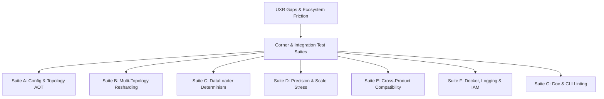

# UXR Usability Analysis & Ecosystem-Aligned Corner Test Plan for MaxText

This document presents an analysis of user-facing pain points, usability gaps, and cross-product dependency friction modes in MaxText. It proposes a concrete, phased implementation plan for introducing **specialized corner test suites** and an **integrated cross-product CI pipeline** designed to prevent regressions, improve developer velocity, and ensure stable training and inference runs on large-scale TPU/GPU topologies.

---

## 1. Integrated UXR & Ecosystem Friction Analysis

MaxText operates within a multi-layered ecosystem of high-performance libraries for training, inference, orchestration, and job submission. Because dependencies release on independent cycles, uncoordinated updates frequently introduce regressions. 

The following table details usability gaps, environment friction points (MT-01 to MT-19), and the proposed testing/CI remedies to shift validation left:

| ID | Friction / Usability Pain Point | Technical Root Cause & Dependencies | Diagnostic / Impact | Proposed Testing Remedy |
| :--- | :--- | :--- | :--- | :--- |
| **MT-01** | VM restarts wipe newly installed XPK elements. | State non-persistence across VM restarts. | Users lose environment setup, forcing rebuilds. | **Suite F: VM State Persistence Test** (Asserts configuration and tool persistence across simulated restarts). |
| **MT-02** | Stacking post-training packages fails to override older library versions. | Installation conflicts with pre-existing packages (specifically `tunix`). | Opaque Python keyword errors that halt post-training setups. | **Suite E: Environment Package Isolation Audit** (Validates clean overrides and environment resets). |
| **MT-03** | GRPO/SFT workflows require building full Docker images from source. | Absence of pre-built, modular release images and clear build progress. | 10+ minute delay per execution attempt with no progress feedback or build time estimates. | **Suite F: Modular Docker & Pre-built Release Validation** (Verifies compatibility of pre-built images and build timeline output). |
| **MT-04** | Unused heavy dependencies (vLLM, tpu-common) are installed during SFT. | Non-modular Dockerfile configurations. | Unnecessary image compilation overhead (adds 2+ minutes per build). | **Suite F: Lightweight Build Pathway Test** (Validates dependency footprint optimization in SFT Dockerfiles). |
| **MT-05** | Docker upload runner script fails silently. | Opaque utility runner execution without logs or stdout capture. | Users unable to self-diagnose; requires manual code edits to trace. | **Suite F: Verbose Log & Exit Code Auditor** (Enforces standard error logging and explicit exit codes). |
| **MT-06** | Documentation interchanges critical environment variables. | Inconsistent naming convention in tutorials (e.g., `MODEL` vs `MODEL_NAME`). | Continuous user copy-paste failures and runtime syntax errors. | **Suite G: Documentation Linting Suite** (Automated markdown command syntax and variable validation). |
| **MT-07** | Tutorial configurations specify non-instruct models with instruct templates. | Mismatched model weight configs and runtime chat templates. | Immediate execution crashes when running tutorials. | **Suite G: Model Configuration Auditor** (Validates matching characteristics between configs and code). |
| **MT-08** | Prerequisite installation steps are buried or out-of-order in explanatory prose. | Suboptimal layout structure and sequencing in user tutorials. | Users skim text, miss vital setup commands (e.g., installing `uv`), or try to run utilities before they are installed. | **Suite G: Document Structure Auditor** (Enforces separation and logical order of execution steps). |
| **MT-09** | XPK commands require redundant `--zone` flags. | CLI does not inherit global `gcloud` configurations. | Redundant input overhead and minor command-line syntax friction. | **Suite G: CLI Argument Inheritance Test** (Ensures CLI tools respect global fallback configurations). |
| **MT-10** | TPU cluster nomenclature is inconsistent across platforms. | Discrepant naming schemas (e.g., Console `v6e-8` vs GKE `ct6e-standard-4t`). | Hardware configuration confusion during cluster mapping. | **Suite G: Naming Mapping Validator** (Checks correctness of taxonomy mapping utilities). |
| **MT-11** | Copied multi-line code blocks inject hidden newline characters. | Format copying issues in public documentation hub. | Compound execution and string parsing errors in terminal sessions. | **Suite G: Copy-Paste Character Sanitizer** (Tests copy-paste text scrubbing on documentation assets). |
| **MT-12** | Ambiguity regarding git cloning and install choices. | Documentation fails to clarify when steps are mutually exclusive or mandatory. | Users perform redundant setup steps (e.g., installing both vLLM and TPU branches) or miss foundational repository checkouts. | **Suite G: Prerequisite Path Validator** (Verifies dependency branches are distinct and explicitly mutually exclusive). |
| **MT-13** | Missing critical setup templates and commands. | Documentation omits fundamental infrastructure preparation steps (e.g., GCS bucket creation for SFT output). | Users are blocked or forced to construct cloud setup commands manually from scratch. | **Suite G: Command Template Auditor** (Verifies documentation contains copy-pastable templates for all prerequisites). |
| **MT-14** | Path assumptions cause execution errors. | Scripts assume a specific working directory without validating the user's path context. | Users run commands from non-root paths and receive path errors (e.g., with `docker_upload_runner.sh`). | **Suite G: Directory-Agnostic Runner Test** (Validates that utility runners execute successfully regardless of invocation CWD). |
| **MT-15** | Context switching across fragmented documentation silos. | Information is scattered across MaxText GitHub, Cloud, and external libraries. | High cognitive load and slower setup times as users hop between distinct doc ecosystems. | **Suite G: Cross-Doc Link Integrity Suite** (Validates correctness and co-location of essential setup links). |
| **MT-16** | Divergent tutorials for expanding post-training techniques. | Lack of centralized architectural strategy for post-training guides (GRPO, Distillation, PPO, DPO). | Maintenance burden increases and documentation diverges as more techniques are added. | **Suite G: Post-Training Documentation Matrix** (Ensures unified branching structure for post-training guides). |
| **MT-17** | XPK commands lack clear env variable configuration guidance. | Setup scripts fail to document or auto-populate necessary cluster and workload variables. | Users must manually search Cloud Console to find details like TPU type or workload ID to fill XPK parameters. | **Suite F: XPK Environment Variable Audit** (Validates existence of helper env scripts and config parsers). |
| **MT-18** | Incompatible TPU profiles in notebooks. | Colab notebooks contain default links with unsupported or unavailable TPU types (e.g., requesting v5p without access). | Immediate failure during first cell execution in Colab, blocking users. | **Suite E: Notebook Hardware Compatibility Test** (Validates TPU availability matches notebook requirements). |
| **MT-19** | Package manager and SSH command failures on locked VMs. | Standard tools (`sudo apt`) are missing or standard SSH structures fail in stripped environments. | Users cannot update libraries or connect to VMs, leading to absolute blockages. | **Suite F: Base Image Tooling Sanity Test** (Checks that minimal required CLI commands are present and functional). |
| **SEC-01**| Project Editor roles lack write access to the Artifact Registry. | Missing IAM permission guidance during Docker image uploads. | Users blocked immediately on image push, forcing manual IAM fixes. | **Suite F: Pre-Execution IAM Validator** (Checks Registry Writer access before starting upload scripts). |
| **SEC-02**| Missing Docker authentication instructions. | Guide omits required configuration commands (e.g., `gcloud auth configure-docker`). | Silent permission denied errors at the final image upload step. | **Suite F: Pre-Execution Auth Validator** (Validates docker auth config prior to running build actions). |
| **SEC-03**| Opaque TPU VM service account mapping. | Documentation lacks clear guidelines on VM-attached service accounts vs personal credentials. | Standard workflows fail on permission checks, requiring manual troubleshooting. | **Suite F: Service Account IAM Auditor** (Verifies attached TPU VM service accounts possess the required GCS/Registry scopes). |
| **UXR-01**| Late-Stage Configuration Failures. | No ahead-of-time (AOT) configuration validation. | Wasted TPU resource hours; errors caught hours into compilation or step runs. | **Suite A: Static Config & Topology Validator** (AOT checks for mesh dimension alignment and memory). |
| **UXR-02**| Restoration Hangs & Resharding OOMs. | Mesh topology mismatches (e.g., 2D to 3D) during checkpoint restoration. | Silent compilation hangs or abrupt OOM errors during restoration. | **Suite B: Checkpoint Resharding Suite** (Mock-reshard testing across virtual topologies). |
| **UXR-03**| Data Pipeline Shard Skipping / Re-reading. | Non-deterministic data loader state restoration upon checkpoint resume. | Silent loss spikes, training on duplicate batches, and data leakage. | **Suite C: DataLoader State Resume Suite** (Step-exact resume verification across hardware scales). |
| **UXR-04**| Numerical Divergence & FP8 Overflows. | Quantization scale underflows or overflows under mixed-precision formats. | Silent numerical corruption or `NaN` loss values at late training steps. | **Suite D: Precision Scale Boundary Suite** (Stress tests for quantization scale updates). |
| **UXR-05**| Unpredictable HBM Compilation OOMs. | Compilation memory footprint exceeds physical hardware capacity. | compilation OOM errors after spending 30+ minutes in XLA. | **Suite A: AOT Memory Profiler** (Static calculation of activation and weight footprints). |
| **UXR-06**| Distributed GRPO networking/connection dropouts. | Brittle connection/handshake management in high-rate multi-node training. | Intermittent connection errors that crash long-running RL/GRPO training workloads without retry logic. | **Suite E: Distributed Connection Resilience Test** (Stress-tests network drops and asserts auto-reconnection). |

---

## 2. Proposed Specialized Corner & Integration Test Suites

To address these findings, we propose seven targeted test suites integrated with standard pytest and CI/CD pipelines.

### Suite A: Config AOT Fail-Fast & Topology Validator
Runs locally on CPU resources without requiring physical TPU hardware allocations.
*   **Target Validation:**
    *   Asserts clean divisibility of dimension sizes (`base_emb_dim`, `base_mlp_dim`, `base_num_decoder_layers`) by computed mesh topology axes (`ici_tensor_parallelism`, `ici_fsdp_parallelism`).
    *   Calculates parameter counts and activation footprints statically to verify peak High Bandwidth Memory (HBM) against target hardware limits (e.g., TPU v5e/v6e, H100/H200).
    *   Rejects incompatible quantization and attention combinations (e.g., `quantization=int8` with custom attention kernels lacking INT8 support) during initial configuration parse.

### Suite B: Multi-Topology Checkpoint Resharding Suite
Uses JAX's `jax.sharding` abstraction to simulate saving and loading checkpoints across virtual hardware layouts.
*   **Target Validation:**
    *   **M-to-N scaling:** Simulates saving a checkpoint under FSDP topology (e.g., `fsdp_parallelism=8, tensor_parallelism=1`) and restoring it under an altered topology (e.g., `fsdp_parallelism=4, tensor_parallelism=2`).
    *   **Stack/Unstack checks:** Validates checkpoint serialization when moving between scanned (stacked) layers and unstacked layers for downstream tasks.
    *   **Preemption Recovery:** Asserts optimizer state (e.g., AdamW moment variables) and data markers restore identically from local emergency backups following simulated preemption signals.

### Suite C: DataLoader Determinism & Shard Resume Suite
Verifies checkpoint restoration fidelity across HF and Grain data loader pipelines.
*   **Target Validation:**
    *   **Step-Continuation Assert:** Asserts that running training continuously for 10 steps yields identical input tensors and loss values as running for 5 steps, checkpointing, resuming, and running another 5 steps.
    *   **Shard Boundary Assert:** Verifies that multiple host processes read non-overlapping data shards, and that resumption starts exactly at the global token index where the checkpoint was saved.
    *   **Empty Shard Handlers:** Simulates EOF boundary conditions and small shard sizes to ensure clean termination instead of process hangs.

### Suite D: Precision Scale & Quantization Boundary Suite
Protects against numerical instability under low-precision configurations.
*   **Target Validation:**
    *   **Extreme Value Probing:** Injects extreme activation values and verifies that scaling mechanisms (`absmax` or custom delayed updates) adjust dynamically without underflowing to zero or throwing `NaN`.
    *   **Quantization Transition:** Asserts correct dynamic application of INT8/FP8 layers when fine-tuning from non-quantized (e.g., BF16) checkpoints.

### Suite E: Integrated Cross-Product Compatibility Suite
Implements the automated Pre-Release Signal pipeline to validate MaxText against its underlying ecosystem.
*   **Target Validation:**
    *   **Pre-Release Hook Testing:** Triggers tests automatically when Release Candidates (RC) are created for core dependencies (vLLM, JAX, Tunix, Pathways, xpk).
    *   **Version Pinning validation:** Programmatically pins the RC version of the dependency in a sandboxed environment while retaining stable versions of other packages to isolate regressions.
    *   **Tutorial & Notebook Verification:** Automatically executes standard tutorials (Pre-Training, SFT, RL/GRPO, and Inference) to verify execution end-to-end.
    *   **Stacking Package Validation:** Audits environment setup scripts to verify that installing post-training libraries cleanly overrides existing pre-training packages (e.g., upgrading `tunix` cleanly without leaving conflicting legacy instances).
    *   **Notebook Profile Compatibility:** Automatically probes notebook hardware layouts to verify that the attached TPU devices meet the run prerequisites (e.g., verifying v5p availability).
    *   **Connection Resiliency Verification:** Simulates distributed network dropouts and jitter in multi-node training contexts (such as GRPO) to confirm auto-reconnect routines function correctly.

### Suite F: Docker Build, Logging & IAM Permissions Diagnostic Suite
Minimizes setup delays, hidden failures, and permission blocks during local or remote container execution.
*   **Target Validation:**
    *   **Lightweight SFT Builds:** Verifies that SFT builds utilize modular Dockerfile paths that exclude heavy, unnecessary components (e.g., `vLLM` or `tpu-common` when not in use) to reduce build times.
    *   **Runner Output Verbosity:** Verifies that Docker upload scripts and execution runners emit clear log levels, standard exit codes, and do not execute opaquely.
    *   **Pre-Execution IAM Probe:** Attempts a test write to the Artifact Registry using local credentials before invoking multi-step builds, ensuring users do not experience authorization failures at the end of the build cycle.
    *   **Pre-Execution Auth & Service Account Audits:** Verifies that local Docker authentication settings are correctly initialized (`gcloud auth configure-docker`) and that the VM-attached service account holds the proper permissions to write checkpoints to GCS and push to the registry.
    *   **State Persistence Assert:** Validates that XPK files and configurations remain persistent across simulated VM restarts.
    *   **Base VM Environment Sanity Checks:** Confirms that critical terminal tools and SSH access paths exist and operate under normal environments.

### Suite G: Documentation, Configuration & Copy-Paste Validator
Validates tutorials, code templates, and CLI configurations to prevent syntax-level friction.
*   **Target Validation:**
    *   **Tutorial Config Mapping:** Verifies that model configuration variables specified in documentation tutorials match the requirements of the accompanying code templates (e.g., preventing the use of non-instruct weights in instruct templates).
    *   **CLI Fallback Verification:** Asserts that CLI wrappers like XPK fall back to global environment configs (e.g., default `gcloud` zone) when command-specific flags are omitted.
    *   **Character Cleansing Test:** Automatically audits public documentation scripts to detect and strip hidden formatting or invalid newline characters from copy-paste containers.
    *   **Nomenclature Check:** Evaluates mapping files that translate TPU terminology between Cloud Console formats and GKE cluster definitions.
    *   **Prerequisite Path and Sequence Linting:** Confirms all prerequisite installations (e.g., cloning MaxText, configuring `uv` or dependencies) are ordered sequentially, with clear warnings on mutually exclusive options.
    *   **Post-Training Tutorial Integration:** Validates that architectural maps for downstream post-training techniques (GRPO, Distillation, PPO) are integrated without divergence.

---

## 3. Dependency Matrix & Integration Topology

To guide cross-product testing, the integration pipeline utilizes the following product dependency matrix:

| Product | Depends On MaxText | Depends On Tunix | Depends On vLLM | Depends On tpu-inference | Depends On xpk | Depends On Pathways | Depends On JAX |
| :--- | :---: | :---: | :---: | :---: | :---: | :---: | :---: |
| **MaxText** | Yes | Yes | Yes | Yes | Yes | Yes | Yes |
| **Tunix** | No | Yes | No | No | No | No | No |
| **vLLM** | No | No | Yes | Yes | Yes | Yes | Yes |
| **tpu-inference** | No | No | Yes | Yes | Yes | Yes | Yes |
| **xpk** | No | No | No | No | Yes | No | Yes |
| **Pathways** | No | No | No | No | No | Yes | Yes |
| **JAX** | No | No | No | No | No | No | Yes |

---

## 4. Phased Implementation Plan

We propose a four-phase integration roadmap to transition from localized validations to an ecosystem-wide automated CI pipeline:

### Phase 1: Local AOT Validation & Tutorial Auditing (Weeks 1–2)
*   **Action Items:**
    *   Implement structural mesh dimension checks in `src/maxtext/configs/pyconfig.py` to throw validation errors prior to JAX initialization.
    *   Integrate standard markdown validators in the documentation build to parse environment variable syntax, check for instruct/non-instruct config consistency, and verify chronological installation steps (e.g., ensuring tools like `uv` are not referenced prior to their setup step).
    *   Implement path checking in script runners to prevent execution failures when users trigger scripts from unexpected current working directories.
    *   Expose a command-line dry-run mode: `python3 src/maxtext/train.py base.yml dry_run=True` to compile the logical HLO graph on virtual devices and calculate expected memory.
*   **Success Metric:** 100% of incompatible mesh, tutorial path, and prerequisite layout errors fail under 1 second on CPU, before container building or hardware compilation begins.

### Phase 2: Checkpoint Resharding & Environment Stacking CI (Weeks 3–4)
*   **Action Items:**
    *   Create automated pytest configurations that utilize virtual device grids to simulate resharding layouts.
    *   Implement dependency isolation checks within setup scripts to verify that installing new packages overrides legacy libraries (`tunix`) without package collision.
    *   Add pre-execution Docker credentials and service account capability audits to prevent late-stage image push blockages.
    *   Add standard pre-execution IAM checks in upload scripts to validate registry permission sets.
*   **Success Metric:** Checkpoint restoration failures, container push auth blocks, and installation conflicts are caught in sandboxed CPU/virtual meshes prior to hardware allocation.

### Phase 3: Modular Containers & Verbose Diagnostics (Weeks 5–6)
*   **Action Items:**
    *   Refactor Dockerfile definitions to expose lightweight pathways for SFT and inference setups, eliminating unused package overhead.
    *   Incorporate standard logging layers, explicit exit codes, and verbose flags into the Docker upload runner utilities, providing time estimates for compilation/build milestones.
    *   Integrate data-loader step-resume validations and multi-node GRPO connection drop resilience tests into regular integration testing.
    *   Validate notebook setups against standard TPU VM environments to guarantee that linked templates match hardware profiles.
*   **Success Metric:** SFT container compilation times are reduced by at least 2 minutes, and execution failures emit structured logs, progress metrics, and connection retry assertions.

### Phase 4: Integrated Ecosystem CI & Compatibility Matrix (Weeks 7–8)
*   **Action Items:**
    *   Deploy pre-release hooks that trigger automated testing when dependencies (JAX, vLLM, Tunix) publish Release Candidates.
    *   Configure a live, auto-updated compatibility dashboard showing verified versions: `MaxText vX.X is compatible with vLLM vY.Y, JAX vZ.Z, and Tunix vA.A`.
*   **Success Metric:** 100% of breaking changes introduced by upstream dependencies are caught and notified before the dependency is released to the public.

---

## 5. User Onboarding & First-Run Corner Cases

When a developer first clones the MaxText repository, they are highly susceptible to environment-related failure modes. The test plan validates the following onboarding corner cases:

### A. GCS Bucket Write & Permission Mismatches
*   **The Failure:** Training compiles, but crashes hours later when attempting the first checkpoint because the environment's Application Default Credentials (ADC) lack write permissions to `base_output_directory`.
*   **Validation:** Attempt to write a small, temporary dummy metadata file to the output directory during early startup to verify read/write permissions before graph compilation.

### B. Gated Hugging Face Repository Credentials
*   **The Failure:** Loading gated models (e.g., Llama, Gemma) fails late during execution because the user lacks an active `HF_TOKEN` or hasn't logged in via the Hugging Face CLI.
*   **Validation:** Perform an early Hugging Face API request to assert credential validation and access permissions for the selected model family prior to initializing JAX layers.

### C. Local Storage & Scratch Space Capacity
*   **The Failure:** Local runs exhaust disk space when saving large checkpoints, causing process freezes or corrupting existing state.
*   **Validation:** Calculate the expected size of checkpoints statically using parameter and optimizer dimensions. Ensure the local target disk has at least `3x` the target checkpoint size in free storage space.

### D. Physical vs. Configured Device Mesh Mismatches
*   **The Failure:** Executing workloads with a configured mesh size that does not align with the physical VM layout results in driver deadlocks.
*   **Validation:** Prior to JAX compilation, verify that `prod(ici_fsdp_parallelism, ici_tensor_parallelism, ici_context_parallelism) == jax.local_device_count()`, throwing an immediate topology mismatch exception if they differ.

### E. Dynamic Data Padding & Recompilation Loops
*   **The Failure:** Shifting sequence lengths in input datasets trigger slow, repeated recompilations on every step.
*   **Validation:** Monitor initial batch shapes. If sequence sizes vary across the first few steps, throw a diagnostic warning recommending padding configurations or `packing=True`.

### F. Legacy Package Stacking Collisions
*   **The Failure:** Upgraded tutorials or workflows crash due to legacy library versions (`tunix`) lingering in the environment.
*   **Validation:** Add a pre-run script check that verifies system packages against active requirements, checking that older library instances are not shadowing the current package installations.

### G. Stateful Tooling Persistence
*   **The Failure:** CLI configurations or temporary elements established for cluster job execution (`xpk`) are cleared out after standard VM restarts.
*   **Validation:** Implement persistence verification for configuration caches and tool assets, providing warning diagnostics if essential tools require re-initialization after a VM restart.

### H. Pre-Flight Docker Authentication Verification
*   **The Failure:** Docker image uploads fail with opaque permissions errors at the very end of a long image build because the docker daemon lacks setup credentials.
*   **Validation:** Check for active registry endpoints in local Docker config files or run a dry-run credential check before launching build commands.

### I. Service Account Permissions and Resource Scopes
*   **The Failure:** VM workflows crash when retrieving files from GCS or writing images to the Artifact Registry because the attached VM service account lacks required scopes.
*   **Validation:** Interrogate local metadata server endpoints during initial setup to assert that the active VM service account possesses correct IAM roles.

### J. XPK Cluster and Workload Variable Pre-population
*   **The Failure:** Submitting cluster tasks through XPK fails because expected variables (TPU type, workload ID, region parameters) are unset, forcing manual cloud console searches.
*   **Validation:** Implement an onboarding dry-run script that probes local env variables and suggests export command overrides.

### K. Notebook Hardware Profiler Sanity Check
*   **The Failure:** Users running Colab notebooks hit driver or allocation errors due to the host executing on standard CPU/GPU instances instead of target TPU versions.
*   **Validation:** Execute early, non-blocking cell checks to inspect `jax.devices()` and verify that physical accelerator shapes match expected TPU configs (e.g., v5p).

### L. Distributed Connection Handshakes and Retries
*   **The Failure:** Distributed workflows (such as GRPO) encounter transient network dropouts, immediately crashing hours of multi-host execution.
*   **Validation:** Configure connection handshake retry budgets and keep-alive settings inside JAX/distributed runtime wrappers to gracefully survive transient drops.

### M. Standard SSH & VM Package Manager Availability
*   **The Failure:** Attempting to run automated setups or SSH overrides fails on stripped custom VM images because package managers (like `apt`) or standard connection paths are absent.
*   **Validation:** Pre-flight shell capability checks to confirm minimal command sets are available, providing explicit, manual alternate recipes if executing inside constrained environments.

---

> [!IMPORTANT]
> Integrating AOT validators and cross-dependency hooks directly into the local development and release workflows helps prevent the majority of runtime startup and update-related failures.

> [!TIP]
> Using JAX's virtual device configurations, these suites can be evaluated within standard CPU-only environments, ensuring high execution velocity and low execution cost.
