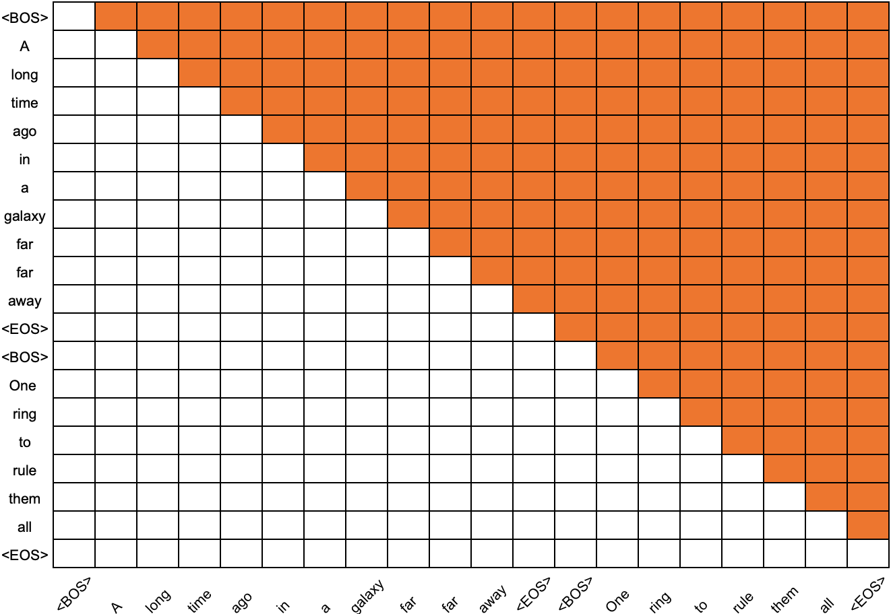
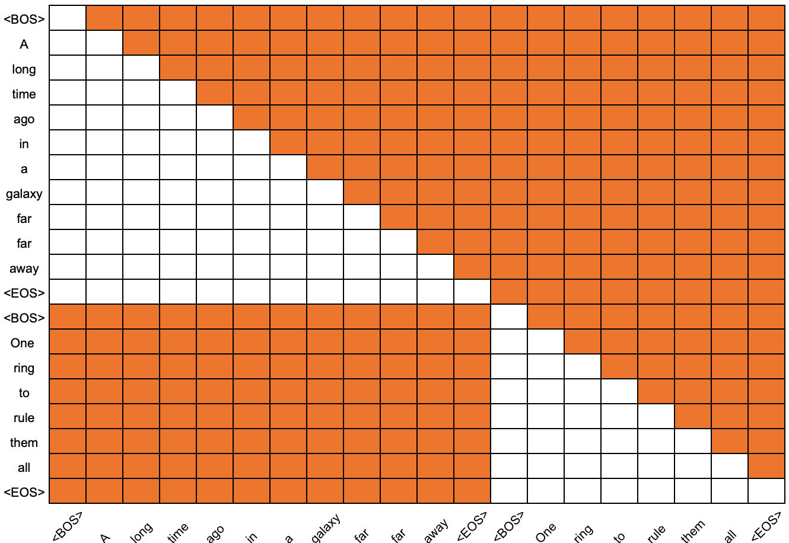

# Sequence Packing <br>&nbsp;&nbsp;&nbsp;&nbsp;In the context of decoder-only models
All samples processed in a batch need to be of the same length, in terms of tokens. This requires that samples exceeding the target length be truncated (or split), and shorter samples be padded. To minimize padding, it is often beneficial to pack shorter sequences together.

When processing packed sequences, the decoder architecture should ideally treat each sequence as distinct. This means that, for each sequence, only its own tokens are used as context to predict the next token. To achieve this, both the positional encodings and attention masking must be adjusted. Specifically:

- **Positional Embeddings** should reflect each token's relative position within its immediate sequence, not its position in the entire packed sequence.
- **Attention Masking** should prevent tokens from attending to tokens in previous sequences.

**Attention Mask**  


**Attention Mask Without Cross Attention Between Packed Sequences**


## Sequence Packing in MaxText
 
MaxText seamlessly handles both the adjustment of positional encoding and attention masking for packed sequences. It does so through the use of four ancillary features: `inputs_position`, `targets_position`, `inputs_segmentation`, and `targets_segmentation`. These can be included in your preprocessed datasets or added on the fly by the MaxText preprocessing pipeline.  

When `inputs_position` and `targets_position` features are included in the dataset, MaxText will adjust the positional encodings to reflect the demarcation between the packed sequences.  The `<key>_position` tensors should contain integers indicating each token’s position within its sequence, with positions zero-based per sequence.   

When `inputs_segmentation` and `targets_segmentation` features are included in the dataset, MaxText (and Pallas) will adjust the attention masking. The `<key>_segmentation` tensors are filled with unique integers for each sequence (e.g., 1 for the first sequence, 2 for the second). Note that zero is reserved as a padding ID.     

The following example illustrates how the additional features are constructed. Three sequences will be packed into a context window of size 13. 

Features prior to packing: 
```python	
{
  "inputs":  [[9, 333, 256, 1], 
             [88, 456, 12, 19],
             [56, 23, 865]],
  "targets": [[9, 333, 256, 1], 
             [88, 456, 12, 19],
             [56, 23, 865]]
}
```
Features following packing:  
```python
{
  "inputs": [9, 333, 256, 1, 88, 456, 12, 19, 56, 23, 865, 0, 0],
  "targets": [9, 333, 256, 1, 88, 456, 12, 19, 56, 23, 865, 0, 0],
  "inputs_position": [0, 1, 2, 3, 0, 1, 2, 3, 0, 1, 2, 0, 0],
  "targets_position": [0, 1, 2, 3, 0, 1, 2, 3, 0, 1, 2, 0, 0],
  "inputs_segmentation": [1, 1, 1, 1, 2, 2, 2, 2, 3, 3, 3, 0, 0],
  "targets_segmentation": [1, 1, 1, 1, 2, 2, 2, 2, 3, 3, 3, 0, 0]
}
```
MaxText includes the option to pack sequences on the fly.  See the [sequence_packing.py](../MaxText/sequence_packing.py) script. Sequences are packed sequentially, and the `<key>_position` and `<key>_segmentation` features are added automatically.


## Bin-packing

The packing of sequences can be optimized over sequential packing by using a bin-packing algorithm.  Bin-packing is not generally feasible for on-the-fly processing, and a pre-packed dataset is typically saved before training. 

Bin-packing algorithms pack items of various sizes into bins of a fixed maximum size, with the goal of minimizing the total number of bins. Bin-packing is an NP-hard problem, so the algorithms are heuristical.  For most distributions, the First-Fit Decreasing algorithm (https://en.wikipedia.org/wiki/First-fit-decreasing_bin_packing) works well. Another option is the Best-Fit Decreasing algorithm.  Since this algorithm involves maintaining a sorted list of bins by remaining capacity it adds more computational overhead. The sorted containers library (https://pypi.org/project/sortedcontainers/0.8.4/) provides options for maintaining the sorted list of bins. 

