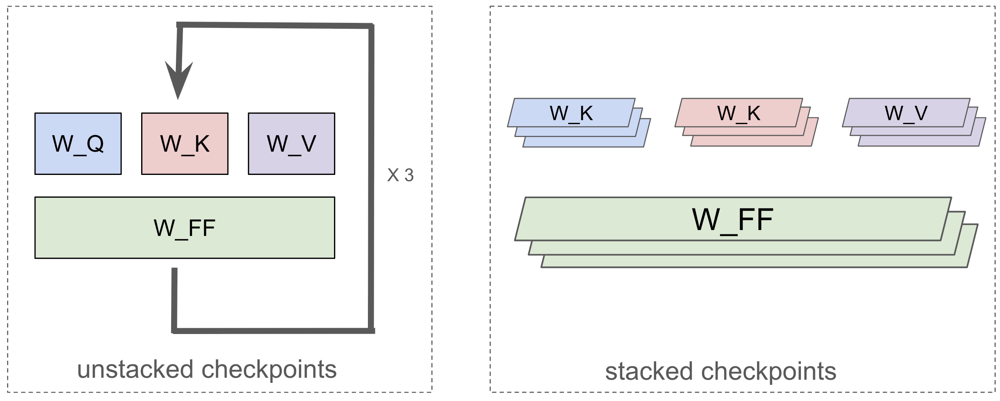

# Checkpoints

## Checkpoint Formats

Checkpoint formats in MaxText can be categorized along two axes: whether they include **training states** (e.g., optimizer properties) and whether the model's parameter weights are **stacked** or **unstacked**. This results in the four types summarized below:

|                           | **Unstacked Weights**  | **Stacked Weights**  |
| :------------------------ | :------------------------------------- | :-------------------------------------- |
| **Without Train State**   | Unstacked Inference Checkpoint         | Stacked Inference Checkpoint           |
| **With Train State**      | Unstacked Training Checkpoint          | Stacked Training Checkpoint            |

We discuss these two axes respectively:

### Training States

Checkpoints with a **training state** contain more than just the model's parameter weights. They also include the **optimizer state** (e.g., momentum values), which is essential for resuming a training run exactly where it left off. These "training checkpoints" are typically saved as snapshots during training to allow for recovery if the process is interrupted.

In contrast, **inference checkpoints** contain only the parameter weights. This is the format most commonly used for sharing models on public platforms like HuggingFace, as they are smaller and ready for immediate use in inference or for fine-tuning from scratch.

### Stacked Checkpoints and JAX Scan Function 

The concept of stacked vs. unstacked checkpoints is specific to JAX-based models that use the `jax.lax.scan` function. `scan` is a powerful JAX feature that compiles sequential operations (like the layers of a Transformer) into a single, highly optimized kernel, avoiding the overhead of a Python for-loop.

To work with `jax.lax.scan`, the model's parameters must be "stacked". For a Transformer model, this means that instead of storing parameters layer-by-layer, similar parameters from all layers are grouped and stacked into single arrays. Figure 1 illustrates the difference:

1. **Unstacked Checkpoints**: Parameters for each layer are stored in separate groups (e.g., `layers_0`, `layers_1`, `layers_2`). This is the common format for models released publicly. (Figure 1, left).
2. **Stacked Checkpoints**: Corresponding parameters from all layers are combined into a single, larger tensor (e.g., all attention weights are in one array). This is the format `jax.lax.scan` expects. (Figure 1, right).


*Figure 1: A comparison of an unstacked checkpoint and a stacked checkpoint for a simple language model.*

The stacked format is highly efficient but has one key requirement: all layers within the `scan` operation must have identical configurations. For models with heterogeneous layers (where layer configurations differ), stacking is not possible, and only unstacked checkpoints can be used.

### Takeaways

To summarize the four checkpoint types:

- **Unstacked Inference Checkpoint:** The standard format for publicly released models (e.g., on HuggingFace). Contains only model weights, stored layer-by-layer. Ideal for starting new training runs or for inference.
- **Unstacked Training Checkpoint:** Contains weights and optimizer state, stored layer-by-layer. Used to resume training for models that do not use `jax.lax.scan` (e.g., models with non-identical layers).
- **Stacked Inference Checkpoint:** Contains only model weights, but they are stacked for `scan`-compatible inference. Created by stripping the optimizer state from a stacked training checkpoint.
- **Stacked Training Checkpoint:** The default format for saving and resuming training runs within MaxText. Contains both weights and optimizer state in a stacked format, optimized for `jax.lax.scan`.

In MaxText, we treat **Unstacked Inference Checkpoints** as the standard format for *importing* a base model. For *saving and resuming* training, MaxText uses **Stacked Training Checkpoints** by default. Support for all four types is available to accommodate various models and use cases.

---

## Checkpoint Conversion

MaxText provides conversion scripts to transform publicly available checkpoints (which are typically "Unstacked Inference Checkpoints") into the format required for MaxText training. These scripts handle the necessary renaming and reshaping of tensor keys.

### Example: Converting a DeepSeek Checkpoint

The `convert_deepseek_ckpt.py` script is a concrete example of this process. It takes a downloaded DeepSeek model and converts it into a MaxText-compatible, stacked checkpoint ready for fine-tuning or inference.

**Usage:**

```bash
python3 -m MaxText.convert_deepseek_ckpt \
    --base_model_path /path/to/downloaded/deepseek/model \
    --maxtext_model_path gs://your-bucket/path/to/save/maxtext/checkpoint \
    --model_size deepseek2-16b
```

This script performs two main actions:
1.  **Mapping:** It maps the layer and tensor names from the original Hugging Face format to the names MaxText expects.
2.  **Stacking:** It reads the individual layer weights, stacks them into single, large tensors, and saves them in the Orbax format that MaxText uses for `scan`-optimized training.

After running the conversion, the output at `maxtext_model_path` will be an "Unstacked Inference Checkpoint" that you can load using the `load_parameters_path` configuration.

---

## Using Checkpoints in Practice

Beyond understanding the formats, it's crucial to know how to use checkpoints in your training workflows. MaxText uses flags in the configuration file or on the command line to manage checkpoints.

### Saving Checkpoints During Training

MaxText automatically saves checkpoints periodically during a training run. These are **Stacked Training Checkpoints** that contain the full state needed to resume.

-   `save_checkpoint_path`: Specifies the directory (e.g., a GCS bucket) where checkpoints will be saved.
-   `checkpoint_period`: The interval, in training steps, at which to save a new checkpoint.

### Resuming an Interrupted Training Run

To resume a run from a previously saved state (including model weights, optimizer state, and the current step number), use the `resume_from_checkpoint_path` flag.

-   `resume_from_checkpoint_path`: Set this to the path of a specific checkpoint directory (e.g., `gs://your-bucket/checkpoints/1000`) to load the complete training state and continue.

### Loading a Base Model for Fine-Tuning

When you want to start a *new* training run (like fine-tuning) from a base model, you only need the model weights, not the original optimizer state. This is common when using a converted public checkpoint.

-   `load_parameters_path`: Set this to the path of an "Inference Checkpoint" (either stacked or unstacked). MaxText will load only the model weights, initialize a new optimizer state, and start training from step 0.

**Key Difference:** Use `resume_from_checkpoint_path` to continue an existing run. Use `load_parameters_path` to start a new run with pre-trained weights.
