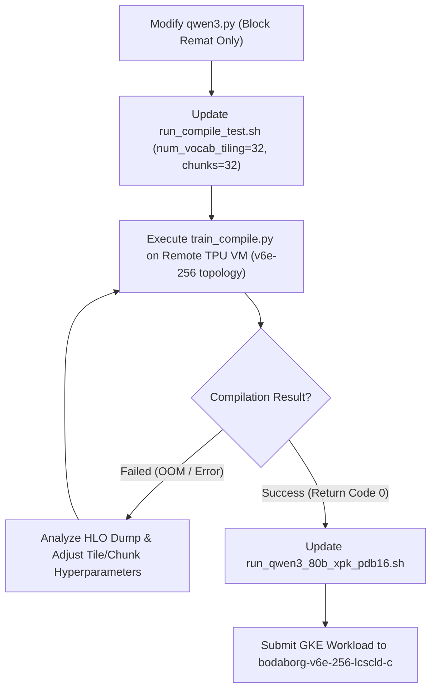

# Qwen3-Next-80B ($PDB=16$) Memory Theory, HLO Forensic Analysis & Execution Plan

**Author**: MaxText Compiler & Hardware Pair  
**Target Hardware**: Cloud TPU v6e-256 (256 chips, 32 GiB / 31.24 GB HBM per chip)  
**Model Architecture**: Qwen3-Next-80B-A3B (13 Scannable Blocks = 26 GDN layers + 13 Full Attention layers = 39 decoder layers + 1 dense layer; 128 MoE experts, Top-8 routing)  
**Configuration**: $PDB = 16$, Sequence Length $= 2048$, Global Batch $= 4096$ sequences ($8,388,608$ tokens), $EP=4$, $FSDP=64$, 2-Layer Host Parameter Offloading  

---

## 1. Executive Summary & Root Cause Theory

### Why $PDB=4$ Passed and $PDB=16$ Failed on TPU v6e-256

During earlier verification, `train_compile` succeeded at $PDB=4$ because peak live HBM temporaries totaled **$21.5\text{ GB}$**, fitting within the $31.24\text{ GB}$ limit. Scaling to $PDB=16$ ($4\times$ larger token batch per chip: $32,768$ tokens/chip) increased intermediate activations across three subsystems:

```
Total HBM Footprint = Stored Checkpoint Residuals + Layer Recomputation Buffers + MoE Dispatch Buffers + Loss Logits Buffers + 2-Layer Parameter Slices
```

Through forensic dissection of the lowered HLO module (`/tmp/hlo_dump.hlo`), we discovered that two specific subsystems exceeded the $31.24\text{ GB}$ limit:

1. **Vocabulary Cross-Entropy Loss Logits (`num_vocab_tiling = 8`)**:
   - $8,388,608$ global tokens with `vocab_size = 128,008` in `float32`.
   - At `num_vocab_tiling = 8`, each tile contains $1,048,576$ tokens, creating `tensor<1048576x128008xf32>` ($536.90\text{ GB}$ unpartitioned, **$8.39\text{ GB}$ per chip**).
   - The HLO graph allocates 5 simultaneous fp32 intermediate buffers (`convert`, `compare`, `broadcast_in_dim`, `subtract`, `exponential`, `multiply`) during loss evaluation:
     $$\text{Peak Live Loss Memory} = 5 \times 8.39\text{ GB} = \mathbf{41.95\text{ GB per chip}} > 31.24\text{ GB}$$
2. **Rematerialization Checkpoint Granularity in `Qwen3NextScannableBlock`**:
   - When checkpoints were placed at every individual layer boundary (39 layers across 13 blocks), the outer `jax.lax.scan` saved $39 \times \text{layer\_inputs}$:
     $$\text{Saved Scan Residuals} = 39 \times \frac{4096 \times 2048 \times 3072 \times 2\text{ bytes}}{64\text{ FSDP shards}} = 39 \times 805.3\text{ MB} = \mathbf{31.41\text{ GB per chip}}$$
   - Saving 39 layer checkpoints consumed 100% of the chip's HBM before any temporary computation could occur.

---

## 2. Mathematical Memory Budget Model for $PDB=16$

To guarantee that total peak HBM memory stays strictly $\le 31.24\text{ GB}$, we enforce the following architectural constraints:

| Subsystem | Configuration | Global Shape / Formula | Footprint Per Chip (v6e) |
| :--- | :--- | :--- | :--- |
| **Model Parameters** | 2-Layer Host Buffer | $2 \times 80\text{B} / 40\text{ layers} / 64\text{ FSDP}$ | $\mathbf{4.50\text{ GB}}$ |
| **Stored Scan Residuals** | 13 Block Checkpoints | $13 \times (4096, 2048, 3072) \times 2\text{ bytes} / 64$ | $\mathbf{10.47\text{ GB}}$ |
| **Intra-Block Recomputation** | Peak 1 Layer (Attention + MoE) | $1 \times \text{layer activations}$ | $\mathbf{2.50\text{ GB}}$ |
| **MoE Chunk Dispatch** | `num_moe_token_chunks=32` | $16.78\text{M tokens} \times 1536 \times 2 / 32 / 64$ | $\mathbf{1.60\text{ GB}}$ |
| **Vocab Loss Logits** | `num_vocab_tiling=32` | $5 \text{ buffers} \times (262144, 128008) \times 4 / 64$ | $\mathbf{2.10\text{ GB}}$ |
| **Total Peak Live Memory** | **All Combined** | Sum of above | $\mathbf{\approx 21.17\text{ GB}} \le 31.24\text{ GB}$ |

$$\text{Safety Margin} = 31.24\text{ GB} - 21.17\text{ GB} = \mathbf{10.07\text{ GB free headroom (32.2\% margin)}}$$

---

## 3. Technical Implementation & Fixes

### A. Block-Level Only Checkpointing in `src/maxtext/models/qwen3.py`
* **Root Action**: Keep `checkpoint_name(inputs, "decoder_layer_input")` exclusively at the entry to `Qwen3NextScannableBlock` (13 checkpoints total).
* **Code State**: `_run_layer` invokes `layer(y, ...)` directly without adding internal checkpoint names, allowing XLA to recompute intra-block layers dynamically during the backward pass rather than buffering them in scan carry.

### B. Vocabulary Loss Tiling (`num_vocab_tiling=32`)
* **Root Action**: Set `num_vocab_tiling=32` in the invocation config.
* **Effect**: Divides the $8.39\text{M}$ global token batch into 32 sequential chunks of $262,144$ tokens each.
* **Peak Logits Size**: Logits tensor drops from $536.9\text{ GB} \to \mathbf{134.2\text{ GB}}$ global ($\mathbf{2.09\text{ GB}}$ per chip on FSDP 64).

### C. MoE Chunking & Barrier Sequentialization
* **Root Action**: Set `num_moe_token_chunks=32` and `moe_chunk_barrier=True`.
* **Effect**: Splits the $16.78\text{M}$ routed tokens into 32 sequential slices of $524,288$ tokens, bounding MoE dispatch temporaries to $\le 1.6\text{ GB}$ per chip.

### D. XLA Flag Propagation in `train_compile.py`
* **Root Action**: Pass `compile_xla_flags="$LIBTPU_INIT_ARGS"` in the CLI arguments so `lowered.compile(compiler_options=compiler_options)` in `train_compile.py` receives the full latency-hiding and host transfer overlap pipeline configuration.

---

## 4. Verification Workflow



---

## 5. Absolute Safety Guardrails
1. **No Cluster Jobs Before Verification**: No JobSets or workloads will be created or submitted to `bodaborg-v6e-256-lcscld-c` until `train_compile.py` successfully emits `Compiled successfully!` with return code 0 on the remote TPU VM.
2. **Workload Protection**: Never touch or delete any foreign workloads on the cluster. Only manage `mohitk-*` jobs.
