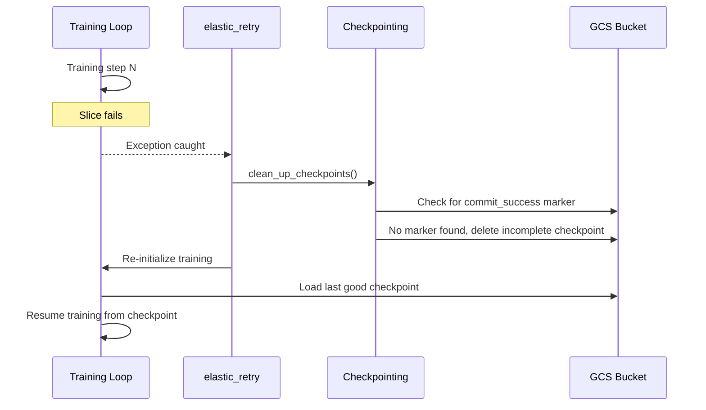

<!--
 # Copyright 2026 Google LLC
#
# Licensed under the Apache License, Version 2.0 (the "License");
# you may not use this file except in compliance with the License.
# You may obtain a copy of the License at
#
#    https://www.apache.org/licenses/LICENSE-2.0
#
# Unless required by applicable law or agreed to in writing, software
# distributed under the License is distributed on an "AS IS" BASIS,
# WITHOUT WARRANTIES OR CONDITIONS OF ANY KIND, either express or implied.
# See the License for the specific language governing permissions and
# limitations under the License.
 -->

# Elastic Training on Cloud TPUs with MaxText and Pathways

Train Qwen3 0.6B across 3 TPU v5e slices on GKE, terminate a slice mid-run, and watch training recover **in-process** from the last checkpoint: same head pod, no job restart, about 40 seconds end to end.

You can run this lab two ways, and they do exactly the same thing. The steps below use the `make` targets from your terminal. If you'd rather step through each command interactively, open [`elastic_qwen3_demo.ipynb`](./elastic_qwen3_demo.ipynb) in this folder instead.

## What is elastic training?

Large model training runs across many TPU slices. When one slice fails, a hardware fault, a preemption, a network blip, the result is that the whole job crashes and you restart from scratch, losing minutes of XLA compilation plus everything since the last checkpoint.

Elastic training keeps the training process alive instead. Pathways detects the dead slice, MaxText's `elastic_retry` catches the error inside the same Python process, Orbax cleans up any half-written checkpoint on GCS, and training rewinds to the last good step. The head pod never restarts, so you skip the cold-start recompile.

Three components make that possible:

- **Pathways** orchestrates training across the slices. A Resource Manager on a CPU node coordinates all slices and detects when one goes down.
- **MaxText** wraps the training loop with `elastic_retry`. When Pathways reports a failure, it catches the exception, cleans up, and restarts training in-process.
- **Orbax** handles checkpointing. Each checkpoint writes to GCS and creates a `commit_success` marker only after all data is flushed, so a checkpoint interrupted mid-write has no marker and is safely discarded on recovery.



## What you'll need

This notebook drives Google Cloud infrastructure, so it expects to run from a machine that already has the CLIs and credentials, Cloud Shell, or a local shell with the Cloud SDK. It does not install them. You'll need:

- A Google Cloud project with billing enabled.
- TPU v5e on-demand quota: at least 48 chips in `us-central1` (request `Tpu-v5-litepod-device` quota in [IAM & Admin > Quotas](https://console.cloud.google.com/iam-admin/quotas)).
- A [HuggingFace token](https://huggingface.co/settings/tokens) with the `read` role. Qwen3 is ungated, but the pipeline wires the token through so you can swap in a gated model later.
- CLI tools: `terraform` (>= 1.5.0), `gcloud`, `kubectl`, and GNU `make` (>= 3.82).

The TPU slices are the expensive part, so keep an eye on cost and check [TPU pricing](https://cloud.google.com/tpu/pricing) before you start. A full run takes about 30 minutes, so budget roughly $30, and always clean up when you're done.

## 1. Set up your environment

Authenticate, then create your config file. You only need to set `PROJECT_ID` and `HF_TOKEN`; everything else has a sensible default.

```bash
gcloud auth application-default login
gcloud config set project <YOUR_PROJECT_ID>

cp .env.example .env
# Edit .env with your project ID and HuggingFace token
```

Run `make help` at any time to see every available target.

## 2. Provision the infrastructure

`make infra` reads your `.env`, generates `terraform.tfvars`, and runs Terraform. It creates the GKE cluster, the TPU and CPU node pools, a GCS bucket, Artifact Registry, a dedicated Cloud Build service account, the IAM bindings, and pushes your HF token to both Secret Manager and a Kubernetes secret.

```bash
make infra
```

This takes about 10 minutes. You should see:

```
  Infrastructure ready
  Cluster: maxtext-elastic-training | Zone: us-central1-a | TPU slices: 3
```

If Terraform fails with quota errors, check your `Tpu-v5-litepod-device` quota in [IAM & Admin > Quotas](https://console.cloud.google.com/iam-admin/quotas).

## 3. Deploy training

`make deploy` runs a Cloud Build pipeline that builds the MaxText image, installs the JobSet API, downloads the tokenizer to GCS, prepares the training data, and deploys the training JobSet.

```bash
make deploy
```

This takes about 6 minutes and ends with `Cloud Build complete`. Check the pods:

```bash
make status
```

You should see 13 pods: 1 head pod (running the training script, with the Pathways Resource Manager and IFRT proxy as sidecars) and 12 worker pods across 3 slices.

## 4. Watch training start

```bash
make logs
```

After XLA compilation (about 2-3 minutes) you should see elastic training enabled and a steady stream of steps:

```
Elastic utils: Elastic training enabled.
Elastic Retry Enabled
completed step: 8, seconds: 0.159, TFLOP/s/device: 43.430, loss: 220.774
completed step: 9, seconds: 0.166, TFLOP/s/device: 41.524, loss: 217.296
completed step: 10, seconds: 0.160, TFLOP/s/device: 43.230, loss: 216.126
```

From then on expect ~43 TFLOP/s/device at ~0.16s/step. Once the step counter passes ~130 (so checkpoint 100 has committed), interrupt the log stream and move on.

## 5. Break it, and watch it recover

The simplest path is the narrated demo, which deploys the JobSet, waits for training, terminates a worker on slice 2, and verifies recovery:

```bash
make demo
```

You should see something close to:

```
[4/5] Simulate slice failure
  Training at step 137, checkpoint 100 committed, safe to terminate
  Terminating pw-elastic-worker-2-0-j55zd (slice 2, --grace-period=0)

[5/5] Verify recovery
  Slice down event detected
  Checkpoint restored
  Training resumed
  Step rewind: 150 -> 101 (restored from last good checkpoint)
  Now training at step 115, same head pod, no job restart
    pathways-proxy restartCount = 0
    jobset restarts            = 0
```

Those two zeros are the whole point: the head pod's proxy sidecar never restarted, and the JobSet never restarted. Recovery happened inside the live process.

If you'd rather drive each step yourself:

```bash
make logs              # wait for steps to pass ~130 (checkpoint 100 committed)
make fail              # waits for a safe window, then terminates a worker on slice 2 (SIGKILL)
make logs              # watch recovery
```

Within ~15 seconds of the termination, the same head pod log stream shows the recovery sequence:

```
Slice down event detected. Retrying.
Found commit_success file. Keeping gs://.../checkpoints/100/.
Elastic attempt 2 out of 10
Restoring checkpoint from gs://.../checkpoints/100.
completed step: 101, ...
```

The step counter dropping (e.g. 150 -> 101) is the rewind to the last committed checkpoint. You can trigger another failure on a different slice with `make fail SLICE=1`.

## 6. Clean up

```bash
make destroy
```

This deletes the JobSet and runs `terraform destroy` to tear down everything. The TPU slices cost ~$58/hr, so don't skip it.

## Going further

- **Cheaper capacity**: the slices are on-demand by default, which guarantees replacement capacity is available when one goes down. For cost-sensitive experimentation, set `TPU_SPOT=true` to use Spot (preemptible) TPUs, or `TPU_RESERVATION=<name>` to consume a reservation (the two are mutually exclusive).
- **A larger model**: during recovery the checkpoint streams through the `pathways-proxy` sidecar, capped at `memory: 100G` in `deploy/jobs/training/jobset.yaml`. Qwen3 0.6B keeps the checkpoint around 7 GiB; to run something bigger (Qwen3 4B is ~135 GiB), raise that memory limit to whatever the CPU node can spare.
- **The elastic training flags** live in `deploy/jobs/training/train.sh`: `elastic_enabled`, `elastic_timeout_seconds`, `elastic_max_retries`, `enable_single_controller` (runs training through Pathways), and `checkpoint_period=100` (frequent enough that recovery rewinds only a little).
- **Debugging**: set `DEBUGGING=true` in `.env` to add XProf profiling and goodput monitoring.

One thing this demo does not show is true elastic _degradation_, where training continues on 2 of 3 slices at reduced throughput while the third is down. That needs dynamic mesh resize, which MaxText does not support yet; today the mesh is fixed at startup, so recovery always means restoring the checkpoint and waiting for all slices.
