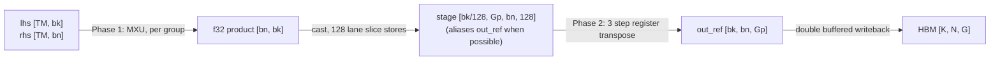

# Spatial Minor TGMM: Writing `[k, n, g]` Directly From One Kernel

## 1. Goal

`tgmm_v2` computes the per group weight gradient of an MoE layer,

$$dW_g = X_g^T \, dY_g \in \mathbb{R}^{K \times N},$$

and writes the result as logical `[g, k, n]` in the default row major layout:
`g` majormost, `k` on sublanes, `n` on lanes.

Some consumers want the spatial minor layout instead: `k` majormost, `n` on
sublanes, `g` on lanes. In JAX terms this is a logical `[g, n, k]` array with
`major_to_minor = (2, 1, 0)`, which XLA prints as `{0, 1, 2}`. Getting there
from `tgmm_v2` needs a separate relayout copy. That copy materializes a second
full size output in HBM and moves the output two more times.

`tgmm_spatial_minor_v2` writes the spatial minor layout directly from a single
Pallas kernel. It never materializes an intermediate `[g, k, n]` buffer, so
its peak HBM is half that of `tgmm_v2` plus a copy at `g = 128`. The
transpose happens on chip, in VMEM and vector registers, before each output
tile is written to HBM once.



## 2. API

| Entry point | Default layout | Runs |
|---|---|---|
| `tgmm_spatial_minor_v2` | `SPATIAL_MINOR_MAJOR_TO_MINOR` | the spatial minor kernel |
| `tgmm_gnk_v2` | `DEFAULT_MAJOR_TO_MINOR` | `tgmm_v2` plus a logical transpose |

Both return the same logical `[g, n, k]` array and accept the same arguments.
`out_major_to_minor` selects the implementation: only
`SPATIAL_MINOR_MAJOR_TO_MINOR` runs the spatial minor kernel; every other
permutation falls back to `tgmm_v2`. The argument is a kernel selection hint.
It does not pin the result layout, because a traced function cannot see the
layout its caller requests. Callers pin the layout on the outermost `jax.jit`
with `out_shardings`.

`tile_info` and `bg` only apply to the spatial minor kernel, so passing them
with a fallback layout is an error rather than a silent no op. `bg` is only
checked for 32 byte output alignment; the kernel always stages every group of
the output window.

## 3. Hardware background

- **XLUs.** Ghostfish (TPU7x), Ghostlite, Sunfish and Pufferfish have 2 XLUs
  per TensorCore; Viperfish, Humufish and Zebrafish have 3. Mosaic emits every
  transpose on XLU 0, and the LLO scheduler spreads independent transposes
  across all XLUs. On Ghostfish the epilogue's bundles show both
  `vxpose.xlu0` and `vxpose.xlu1`.
- **Native transpose.** The XLU transposes a `(128, 128)` 32 bit tile. Mosaic
  lowers a transpose that swaps the two minor dims of a rank 3 value to one
  native transpose per leading index.
- **Major/sublane swap.** For a transpose that swaps the third minor and
  second minor dims, Mosaic uses an in register shuffle over groups of 8
  vregs. It touches no memory and does not use the XLU.
- **Strided access is the trap.** A strided load or store whose stride
  exceeds the sublane tile does not become one access per vreg. Mosaic emits
  one single sublane access per sublane, plus merges. This design only uses
  full vreg, contiguous loads and stores.

## 4. Kernel design

### 4.1 Grid and tiling

```
grid = (num_k, num_n, num_m_tiles)        # m innermost
out block index = (k, n, 0)               # independent of m
```

- **Output written once.** The output block index ignores `m`, so each
  `(bk, bn, Gp)` tile stays in VMEM across all `m` steps and is written back
  once. Pallas double buffers the output window, so the writeback of one tile
  overlaps the compute of the next.
- **Coarse `m` tiles.** `TM` is chosen to cover all of `M` in one step
  (`TM = 4096` at the benchmark shape) whenever the VMEM budget allows.
  Groups are then looped over inside the kernel body, which costs a scalar
  loop instead of one pipeline step per group.
- **Tile sizes.** `bn` is at most 128 and a multiple of 16. `bk` is the
  largest of 1024, 512, 256 or 128 that fits the budget in section 5. At the
  benchmark shape the chooser selects `TM = 4096, bk = 512, bn = 128`.
- **Group padding.** `Gp = max(8, align_to(G, 8))` for `G <= 128`, and
  `align_to(G, 128)` above that. A tight `Gp` shrinks the stage and the
  epilogue for small `G`. When `G` is a multiple of 8, no slice is needed
  after the kernel.

### 4.2 Group ownership across `m` tiles

The wrapper computes each group's row range `m_bounds` (`int32[G + 1]`) and,
for every `m` tile, the range of groups `[g_first, g_last]` it must process.
All three arrays are scalar prefetched into SMEM.

```python
last_touch = jnp.maximum(ends - 1, starts)   # non decreasing
tile_lo = jnp.arange(num_m_tiles) * TM
g_first = jnp.searchsorted(last_touch, tile_lo, side="left")
g_last = jnp.searchsorted(starts, tile_lo + TM, side="left") - 1
g_last = g_last.at[-1].set(G - 1)
```

Every group, including an empty one, is finalized by exactly one `m` tile.
This matters because the stage persists across output tiles: every group slot
must be rewritten for every output tile.

`group_offset` selects the window of `group_sizes` to compute. Groups before
the window still own rows, so `m_bounds` is taken from the global cumulative
sums.

### 4.3 Phase 1: per group matmul into the stage

For each group owned by the current `m` tile:

1. **Chunk size.** Rows are processed in chunks of `tm` rows, sized to the
   average group:
   `tm = min(128, TM, max(32, align_to(cdiv(M, G), sublane)))`.
   At `M = 4096, G = 128` each group has 32 rows, so `tm = 32` instead of 128.
   This removes a 4x waste of MXU work on rows that belong to other groups.
2. **Swapped contraction.** Each chunk computes `rhs_chunk^T @ lhs_chunk`, a
   `[bn, bk]` f32 product with `n` on sublanes and `k` on lanes: the
   orientation the epilogue consumes. Rows outside the group are masked on
   `rhs` only, since one zeroed operand zeroes the product.
3. **Single chunk fast path.** When the whole group fits in one chunk of the
   current `m` tile, the product is cast in registers and stored straight into
   the stage. It never touches the f32 accumulator in VMEM.
4. **Multi chunk groups.** The first chunk writes the accumulator directly
   (no zeroing pass). Later chunks, including chunks in a later `m` tile, add
   to it. When the group ends, the accumulator is cast and stored into the
   stage.
5. **Stage stores.** The product is stored one 128 lane slice at a time,
   `stage[kc, g, :, :] = product[:, kc*128:(kc+1)*128]`. `g` and `kc` are major
   dims, so these are plain aligned stores with a dynamic `g`.

The f32 result is rounded once, when a completed group is cast to the output
dtype. That is the same single rounding `tgmm_v2` performs. The accumulator is
always f32; `acc_dtype` only affects the `tgmm_v2` fallback.

### 4.4 In place staging

When `num_m_tiles == 1` and `G == Gp == 128`, the output block has the same
bytes and VMEM tiling as the stage. The kernel then views `out_ref` as the
stage during Phase 1, and Phase 2 transposes each block in place: it reads a
block into registers and writes the transposed block back to the same bytes.
This removes the stage scratch buffer (16 MiB at the benchmark shape).

### 4.5 Phase 2: the transpose epilogue

Runs once per output tile, on the last `m` step.

For 16 bit outputs the stage and output are bitcast to `uint32` along the `n`
axis, so each word holds a pair of adjacent `n` values. Both buffers pack `n`
the same way, so a word means the same pair of values in both.

- `stage_u32 : uint32[bk // 128, Gp, bn // 2, 128]`
- `out_u32 : uint32[bk, bn // 2, Gp]`

For each 128 group chunk, each 128 column `k` chunk `kc`, and each block `p` of
8 consecutive `n` pairs:

```python
v = stage_u32[kc, g_slice, p*8:(p+1)*8, :]   # [G_blk, 8, 128], contiguous loads
v1 = jnp.transpose(v, (1, 0, 2))            # [8, G_blk, 128], register shuffle
v2 = jnp.transpose(v1, (0, 2, 1))           # [8, 128, G_blk], native XLU transpose
v3 = jnp.transpose(v2, (1, 0, 2))           # [128, 8, G_blk], register shuffle
out_u32[kc*128:(kc+1)*128, p*8:(p+1)*8, g_slice] = v3   # contiguous stores
```

Every load and store is a full, contiguous vreg. The XLU does the only cross
lane work; the two major/sublane swaps are register shuffles. For f32 outputs
the same three steps run on the buffers directly, without the bitcast.

## 5. VMEM budget

`calculate_tgmm_spatial_minor_tiling` picks the largest `bk`, then the largest
`TM`, whose budget fits the scoped VMEM limit (default
`0.9 * vmem_capacity_bytes`):

| Buffer | Shape | Copies | `TM=4096, bk=512, bn=128, G=128`, bf16 |
|---|---|---:|---:|
| `lhs` block | `[TM, bk]` | 2 | 8.00 MiB |
| `rhs` block | `[TM, bn]` | 2 | 2.00 MiB |
| Output window | `[bk, bn, 128 or Gp]` | 2 | 32.00 MiB |
| Stage | `[bk/128, Gp, bn, 128]` | 0 when in place, else 1 | 0 |
| f32 accumulator | `[bn, bk]` | 1 | 0.25 MiB |
| **Total** | | | **42.25 MiB** |

At `G = 16` the stage cannot alias the output window (`G != 128`) but is only
2 MiB (`Gp = 16`), for 44.25 MiB total. The model counts the output window at
128 lanes for `G <= 128`, which is conservative when `Gp < 128`.

`bk = 1024` does not fit at `bn = 128, G = 128`: the double buffered output
window alone would take 64 MiB.

## 6. Results

Ghostfish (TPU7x), `m = 4096, k = 7168, n = 2048`, bf16. Latencies are wall
time per call. Sponge `0d8c3572-acae-4ef7-a117-ac032473b870`.

| `g` | Implementation | Result layout | Latency | Peak HBM | XProf session |
|---:|---|---|---:|---:|---|
| 128 | `tgmm_spatial_minor_v2` | `{0,1,2}` | 8.74 ms | 3.83 GB | `ksmurthy-8519083234139912043` |
| 128 | `tgmm_v2` + copy | `{0,1,2}` | 6.16 ms | 7.59 GB | `ksmurthy-14831909410916533840` |
| 128 | `tgmm_v2`, transposed view | `{1,0,2}` | 4.46 ms | 7.59 GB | |
| 16 | `tgmm_spatial_minor_v2` | `{0,1,2}` | 3.27 ms | 3.83 GB | `ksmurthy-8432756797868165834` |
| 16 | `tgmm_v2` + copy | `{0,1,2}` | 2.92 ms | 4.30 GB | `ksmurthy-7753179372749662140` |
| 16 | `tgmm_v2`, transposed view | `{1,0,2}` | 0.61 ms | 1.02 GB | |

The `{1,0,2}` rows are a different layout and are shown only for reference;
they are not a spatial minor result.

What this means:

- **Memory.** The spatial minor kernel halves peak HBM at `g = 128`
  (3.83 GB against 7.59 GB) and lowers it at `g = 16` (3.83 GB against
  4.30 GB), because no intermediate is materialized.
- **Speed.** It is not yet as fast as `tgmm_v2` plus a copy: 1.42x slower at
  `g = 128` and 1.12x slower at `g = 16`. In the `g = 128` trace, `tgmm_v2`
  spends 1.38 ms per call in its matmul, using large `256 x 7168` by
  `256 x 768` tiles, and the copy then streams the output at about
  1.4 TiB/s for 4.74 ms. The two run back to back. Use the spatial minor
  kernel when peak HBM matters more than latency.
- **Epilogue cost.** A standalone kernel that only runs the Phase 2 epilogue
  on one 8.39 MB tile (`bk = 256, bn = 128, G = 128`), including the tile's
  HBM transfers, takes 0.029 ms. Which phase dominates the full kernel now has
  not been measured; see section 7.

## 7. Remaining work

In expected order of payoff; measure each change alone against the numbers
above.

1. **Re-measure where the time goes.** Repeat the phase ablations (empty
   Phase 1, empty Phase 2, both empty) on the current kernel to find the
   dominant phase before optimizing further.
2. **Phase 1 MXU efficiency.** Per group matmuls of `[32, 128]^T x [32, 512]`
   use the MXU poorly. Batching several small groups into one matmul with a
   block diagonal row mask, or a larger `bn` when VMEM allows, should raise
   MXU utilization.
3. **Overlap Phase 2 with Phase 1.** Phase 2 of a tile runs after its Phase 1
   on the same core. Running the epilogue of tile `t` inside the group loop of
   tile `t + 1` would let register shuffles and XLU work co issue with MXU
   work, at the cost of a second stage buffer.
4. **Budget model precision.** Count the output window at `Gp` lanes rather
   than 128 for small `G`, which would admit a larger `bk` at `g = 16`.
5. **Two TensorCore chips.** All grid dims are `"arbitrary"`, so the kernel
   runs on one core. Marking `k` as `"parallel"` needs the padding group
   zeroing moved to a per core first step.
